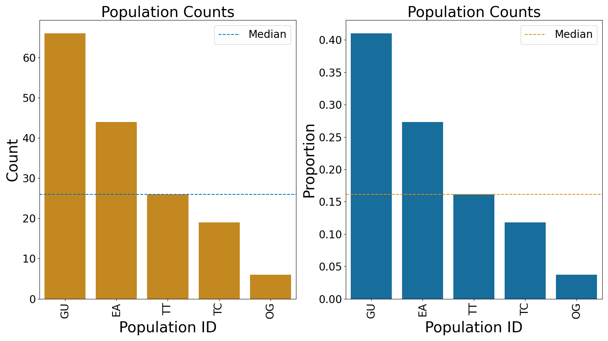
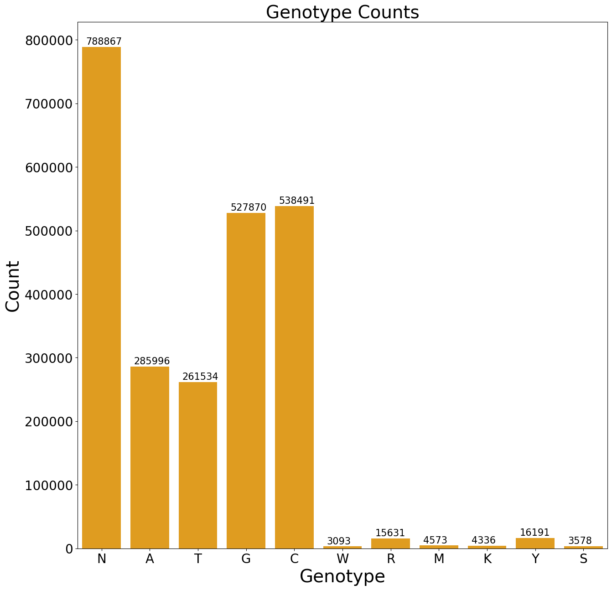
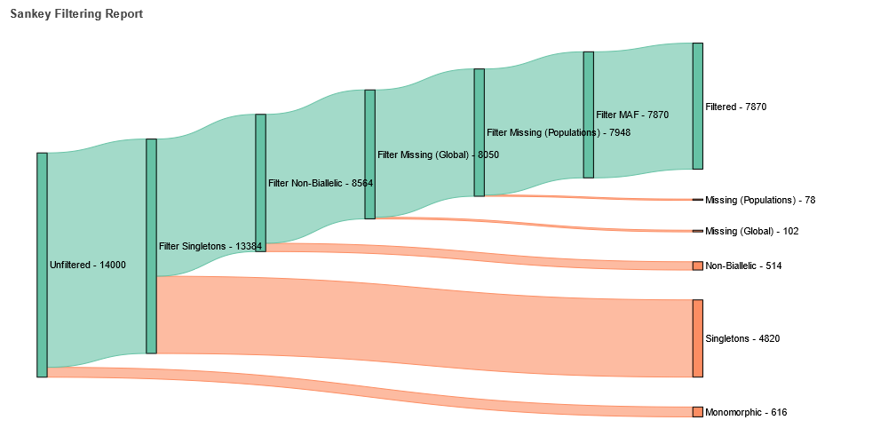
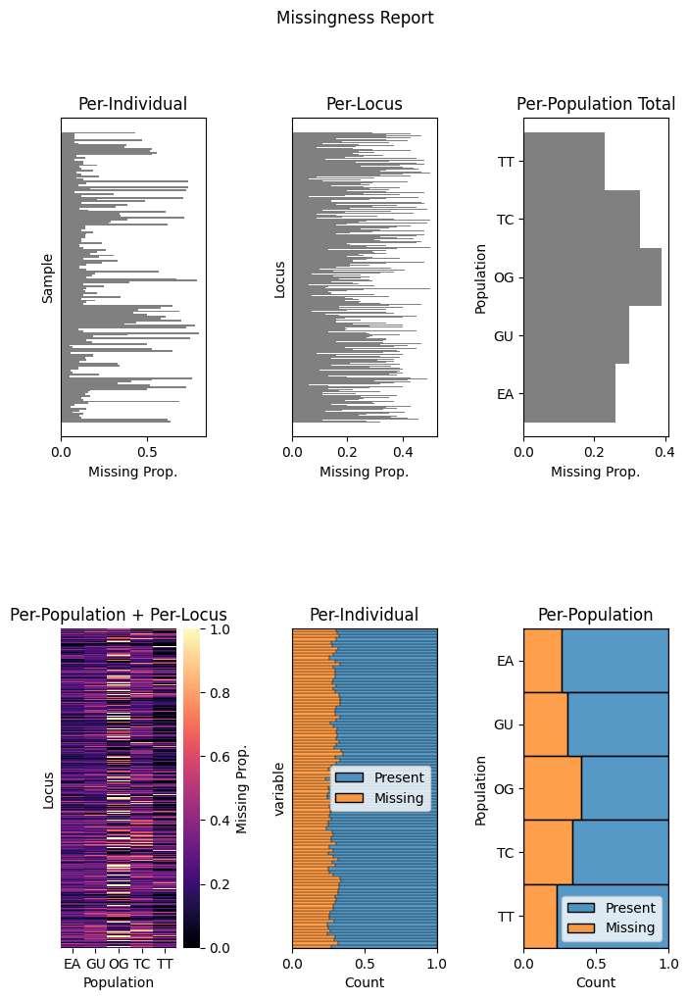
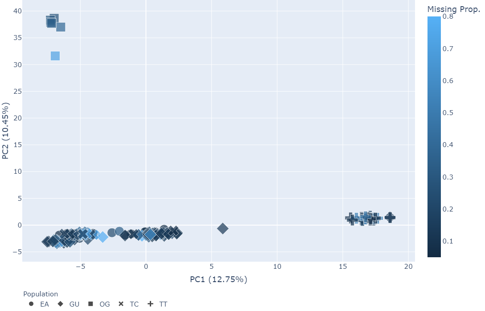
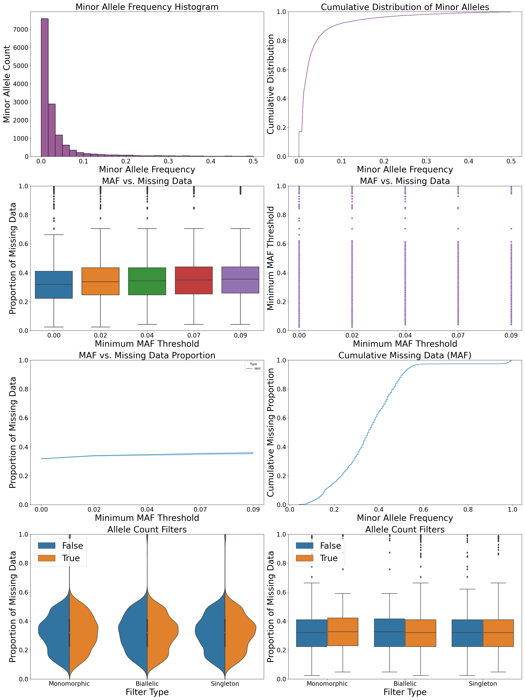

Getting Started
====================

This guide provides an overview of how to get started with the SNPio library. It covers the basic steps to read, manipulate, and analyze genotype data using the `GenotypeData` class.

Installation
-------------------

Before using SNPio, make sure it is installed in your Python environment. You can install it using pip. In the project root directory (the directory containing setup.py), type the following command into your terminal:

.. code-block:: shell

   pip install snpio

Importing SNPio
--------------------

To start using SNPio, import the necessary modules:

.. code-block:: python

   from snpio import GenotypeData
   from snpio import Plotting
   from snpio import NRemover2

.. note::

    *Important Notes:* GenotypeData and NRemover2 treat gap ('-', '?', '.') and 'N' characters as missing data. Also, if your input file is PHYLIP or STRUCTURE, they will be forced to be biallelic. If you need more than two alleles per site, then you must use the VCF file format, and even then some of the transformations force all sites to be biallelic.

The Population Map File
------------------------------

To use `GenotypeData` you'll need a population map (popmap) file. It is basically just a two-column tab-delimited file with SampleIDs in the first column and the corresponding PopulationIDs in the second column. 

For example::

    Sample1\tPopulation1
    Sample2\tPopulation1
    Sample3\tPopulation2
    Sample4\tPopulation2
    ...

Optional Input files
-------------------------

There are some other optional input files you can provide as well. These include a phylogenetic tree in NEWICK format and the site rates and Q-matrix obtained from running IQ-TREE. THe latter two can be found in the output from IQ-TREE.

Currently, we don't have functionality to do any analyses on the tree, site_rates, and q-matrix objects, but we plan to implement more features that incorporate them in the future.

Reading Alignment with Genotype Data
----------------------------------------

The first step is to read genotype data from an alignment. The `GenotypeData` class can read and write PHYLIP, STRUCTURE, and VCF files. VCF files can be either compressed with bgzip or uncompressed. GenotypeData can also convert between these three file formats and makes some informative plots. An example script, `run_snpio.py` is provided to showcase some of SNPio's functionality.

The files referenced in the code blocks below can be found in the provided `example_data/` directory.

The `GenotypeData` class provides methods to read and write data in various formats, such as VCF, PHYLIP, STRUCTURE, and custom formats. Here's an example of reading genotype data from a PHYLIP file:

.. code-block:: python

    # Read the alignment, popmap, and tree files
    gd = GenotypeData(
        filename="example_data/phylip_files/phylogen_subset14K.vcf",
        popmapfile="example_data/popmaps/phylogen_nomx.popmap",
        force_popmap=True,
        filetype="auto",
        qmatrix_iqtree="example_data/trees/test.qmat",
        siterates_iqtree="example_data/trees/test.rate",
        guidetree="example_data/trees/test.tre",
        include_pops=["EA", "TT", "GU"], # Only include these populations. There's also an exclude_pops option that will exclude the provided list of populations.
    )

GenotypeData Properties
^^^^^^^^^^^^^^^^^^^^^^^^^

.. list-table:: 
   :widths: 25 75
   :header-rows: 1

   * - Property
     - Description
   * - ``inputs``
     - Get or set the GenotypeData keyword arguments as a dictionary.
   * - ``num_snps``
     - Get the number of SNPs in the dataset. It returns the number of SNPs per individual as an integer.
   * - ``num_inds``
     - Get the number of individuals in the dataset. It returns the number of individuals in the input data as an integer.
   * - ``populations``
     - Get the Population IDs. It returns a list of Population IDs, which can be either strings or integers.
   * - ``popmap``
     - Get or set a dictionary object with Sample IDs as keys and Population IDs as values.
   * - ``popmap_inverse``
     - Get or set an inverse popmap dictionary with Population IDs as keys and lists of Sample IDs as values.
   * - ``samples``
     - Get or set the Sample IDs in input order. It returns a list of Sample IDs.
   * - ``snpsdict``
     - Get or set a dictionary with Sample IDs as keys and lists of genotypes as values.
   * - ``snp_data``
     - Get or set the genotypes as a 2D list of shape (n_samples, n_loci).
   * - ``genotypes_012``
     - Get or set the encoded 012 genotypes as a 2D list, numpy array, or pandas DataFrame.
   * - ``genotypes_onehot``
     - Get or set the one-hot encoded SNPs format of shape (n_samples, n_loci, 4).
   * - ``genotypes_int``
     - Get or set the integer-encoded (0-9 including IUPAC characters) SNPs format.
   * - ``alignment``
     - Get or set the alignment as a BioPython MultipleSeqAlignment object.
   * - ``vcf_attributes``
     - Get or set the path to the HDF5 file containing Attributes read in from the VCF file.
   * - ``loci_indices``
     - Get or set the column indices for retained loci in the filtered alignment.
   * - ``sample_indices``
     - Get or set the row indices for retained samples in the alignment.
   * - ``ref``
     - Get or set the list of reference alleles of length equal to the number of SNPs.
   * - ``alt``
     - Get or set the list of alternate alleles of length equal to the number of SNPs.
   * - ``q``
     - Get or set the q-matrix object for the phylogenetic tree.
   * - ``site_rates``
     - Get or set the site rate data for the phylogenetic tree.
   * - ``tree``
     - Get or set the Newick tree provided at class instantiation.

Here's an example of the alignment object::

    Alignment with 161 rows and 6724 columns
    GNNNNCNNNNRNCNTNCNANNCNCGGGGCNNNCNTNNNTNNNNN...NCN EAAL_BX1380
    NNGNNCNCNRGNNGTNCCNNNCCSNNNNNNGNNNYCCATTNGKN...NNT EAAL_BX211
    GAGTACNCGGRGCNTTCCACGCNCGGGGCGGTCNTCCAYTCGTN...ANT EAAL_BXEA27
    GAGTACCCGRRGCGTTYCACGNCCGGGGCGGTCGTCCATTCGTR...ACT EAGA_BX301
    GAGTACNCGGGGCGTTYCACGCNCNGGGCGGTNGNCCATTCGTG...ACT EAGA_BX346
    GAGTACCCGGRGCNTTCCACGCCCGGGGCGGNCNTCCATTCGTG...ACT EAGA_BX472
    GAGTACNNGGGGCGTTCCACNCCCGGGGCGGTCGTCCATTCNTG...ACT EAGA_BX660
    GAGTACNCGGRGCGTTCCACNCNSGGRGCGGTCGNCCATTCGTG...ACT EAGA_BXEA15_654
    GWGTACCCGGRGCNTTCCACGCNSGGGGCGGTCGTCCATTYGTG...ACT EAGA_BXEA17
    GAGTACCCGGGGCGTTCCACGCCCGGGGCGGNCGNCCATTYGTG...ACT EAGA_BXEA21
    NAGTACCCGGGGCGTTCCANNCNNGGGGCGGTCNYCCATTCGTG...ACT EAGA_BXEA25
    GNNNASNNGNRNCNTTNNNCNNNCNNNGNGGNNNNNNNTNNNTG...ANN EAGA_BXEA29_655
    GAGTACCCGGRGCGTTCCACGCCNGGGGCGGTCGNCCATTCGGN...ACT EAGA_BXEA31_659
    GAGTACCCGGAGCGTTCCACGNCSGNGGCGNNCGTCNATTCGTG...ACT EAGA_BXEA32_662
    GWGTACNCGNGGCGTTCCACGNNNNGGGNGGTCGTCNNTNCGTG...ACT EAGA_BXEA33_663
    GAGTACCCGGRGCGTTCCACGNCSGGGGCGGTCGNCNATTCGTG...ACT EAGA_BXEA34_665
    GAGTACNCGGRGCGTTCCACNNNSGGGGCGGTNGNCCANNCNTG...ACT EAGA_BXEA35_666
    GWGTNCCYGGRGCNTNCCACRNCCGGGGCGNTCGNCCNTTCGNG...ACT EAGA_BXEA49_564
    ...
    NANNNCNNGGGGCNTTNCNNNCCCGGGNCNGNCNTCCATTNNNN...ANT TTTX_BX23

Data Transformation and Analysis
-------------------------------------

Once you have the genotype data, you can perform various data transformations and analyses. Here's an example of running principal component analysis (PCA) on the genotype data:

.. code-block:: python

    # Generate plots to assess the amount of missing data in alignment.
    gd.missingness_reports(file_prefix="unfiltered")

    # Does a Principal Component Analysis and makes a scatterplot.
    components, pca = Plotting.run_pca(
            gd # GenotypeData instance from above.
            plot_dir_prefix="snpio",
            file_prefix=None,
            n_components=None,
            center=True,
            scale=False,
            n_axes=2,
            point_size=15,
            font_size=15,
            bottom_margin=0,
            top_margin=0,
            left_margin=0,
            right_margin=0,
            width=1088,
            height=700,
            plot_format="png",
            dpi=300,
    )
    explvar = pca.explained_variance_ratio_ # Can use this to make your own plot.

    # Access other transformed genotype data and attributes

    # 012-encoded genotypes, with ref=0, heterozygous=1, alt=2
    genotypes_012 = genotype_data.genotypes_012(fmt="list") # Get 012-eencoded genotypes.

    # Onehot-encoded genotypes.
    genotypes_onehot = genotype_data.genotypes_onehot

    # Filename of the HDF5 file containing the VCF file data..
    # Will be None if a VCF file wasn't used.
    vcf_attributes = genotype_data.vcf_attributes 

    # Access optional properties
    q_matrix = genotype_data.q
    site_rates = genotype_data.site_rates
    tree = genotype_data.tree

GenotypeData Plots
----------------------------

There are a number of informative plots that GenotypeData makes.

Here is a plot describing the counts of each found population:

Here is a plot showing the distribution of genotypes in the alignment:

Alignment Filtering
--------------------

The `NRemover2` class provides methods for filtering DNA sequence alignments based on the proportion of missing data, the minor allele frequency (MAF), and monomorphic, non-biallelic, and singleton sites. It allows you to filter out sequences (samples) and loci (columns) that exceed the provided thresholds. Missing data filtering options include removing loci whose columns exceed global missing and per-population thresholds and removing samples that exceed a per-sample threshold. It also can filter out linked SNPs using the CHROM and POS VCF file fields (requires VCF input). The class also provides informative plots pertaining to the filtering process.

Attributes:
--------------

- `alignment` (list of Bio.SeqRecord.SeqRecord): The input alignment to filter.
- `populations` (list of str): The population for each sequence in the alignment.
- `loci_indices` (list of int): Indices that were retained post-filtering.
- `sample_indices` (list of int): Indices that were retained post-filtering.
- `msa`: (MultipleSeqAlignment): BioPython MultipleSeqAlignment object.

Methods:
-------------

- `nremover()`: Runs the whole NRemover2 pipeline. Includes arguments for all the thresholds and settings that you'll need. You can also toggle a threshold search that plots the proportion of missing data across all the filtering options across multiple thresholds.

Usage Example:
-------------------

Here's an example to illustrate how to use the `NRemover2` class:

.. code-block:: python

   # Create an instance of NRemover2
   # Provide it the GenotypeData instance from above.
    nrm = NRemover2(gd)

    # Run nremover to filter out missing data.
    # Set the thresholds as desired.
    # Returns a GenotypeData object.
    gd_filtered = nrm.nremover(
        max_missing_global=0.5, # Maximum global missing data threshold.
        max_missing_pop=0.5, # Maximum per-population threshold.
        max_missing_sample=0.8, # Maximum per-sample threshold.
        singletons=True, # Filter out singletons.
        biallelic=True, # Filter out non-biallelic sites.
        monomorphic=True, # Filter out monomorphic loci.
        min_maf=0.01, # Only retain loci with a MAF above this threshold.
        unlinked=True, # Filter out linked SNPs based on VCF file CHROM fiield.
        search_thresholds=True, # Plots with parameter sweeps across multiple thresholds.
        plot_dir_prefix="snpio", # Where to save the plots to.
        file_prefix="test", # Set prefix for output file. If None (default), then no prefix.
    )

    # Makes an informative plot showing missing data proportions.
    gd_filtered.missingness_reports(file_prefix="filtered")

    # Run a PCA on the filtered data and make a scatterplot.
    Plotting.run_pca(gd_filtered, file_prefix="filtered")

Running the above code makes a number of informative plots. See below.

Here is a Sankey diagram showing the number of loci removed at each filtering step.

Here is the proportions of missing data for the filtered missingness report:

Here is the PCA we ran on the filtered data, with colors being a gradient corresponding to the proportion of missing data in each sample:

The below two plots show the missingness proportion variance among multiple thresholds if you used set `search_thresholds=True` when you ran the `nremover()` function. The first makes plots for the missing data filters, and the second for the MAF, biallelic, monomorphic, and singleton filters. they are shown for both globally and per-population.

First, the missing data filter report:

.. image:: ../../plots/missingness_report.png
   :alt: Plots showing missingness proportion variance for each filtering step.
   :height: 200 px
   :width: 200 px
   :scale: 200 %
   :align: center

And now the MAF, biallelic, singleton, and monomorphic filter report:

If you do not want to use some of the filtering options, just leave them at default for the ones you don't want to run.

Writing to File and File Conversions
--------------------------------------

If you want to write your output to a file, just do use one of the write functions. Any of the input alignment formats can be converted to any of supported file formats.

.. code-block:: python

    gd_filtered.write_phylip("example_data/phylip_files/nremover_test.phy")

    gd_filtered.write_structure("example_data/structure_files/nremover_test.str")

    gd_filtered.write_vcf("example_data/vcf_files/nremover_test.vcf")

For more detailed information about the available methods and attributes, refer to the API Reference.

That's it! You have successfully completed the basic steps to get started with SNPio. Explore the library further to discover more functionality and advanced features.

Indices and Tables
----------------------

* :ref:`genindex`
* :ref:`modindex`
* :ref:`search`

