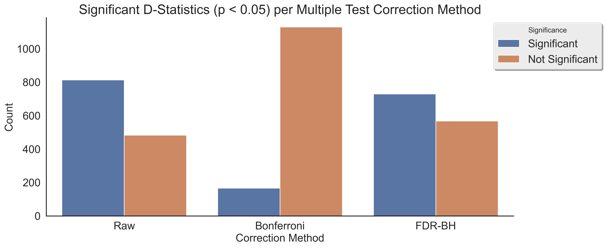

Getting Started
===============

.. image:: ../../../snpio/img/snpio_logo.png
  :align: center
  :alt: SNPio Logo, decorative image.
  :width: 800px
  :height: 400px
  :scale: 100%
  :class: img-responsive

This guide provides an overview of how to get started with the SNPio library. It covers the basic steps to read, manipulate, and analyze genotype data using the VCFReader, PhylipReader, StructureReader, and NRemover2 classes. SNPio is designed to simplify the process of handling genotype data and preparing it for downstream analysis, such as population genetics, phylogenetics, and machine learning. The library supports various file formats, including VCF, PHYLIP, and STRUCTURE, and provides tools for filtering, encoding, and visualizing genotype data. This guide will help you get up and running with SNPio quickly and efficiently.

``VCFReader``, ``PhylipReader``, and ``StructureReader`` classes are used to read genotype data from VCF, PHYLIP, and STRUCTURE files, respectively. These classes load the data into a ``GenotypeData`` object that has various useful methods and properties.

The ``NRemover2`` class is used to filter genotype data based on various criteria, such as missing data, minor allele count, minor allele frequency, and more. The ``GenotypeEncoder`` class is used to encode genotype data into different formats, such as one-hot encoding, integer encoding, and 0-1-2 encoding, for downstream analysis and machine learning tasks.

The ``Plotting`` class provides methods to visualize genotype data, such as running principal component analysis (PCA) and generating missing data reports. The ``PopGenStatistics`` class is used to perform population genetic analyses on SNP datasets, such as D-statistics, Fst outliers, heterozygosity, nucleotide diversity, and Analysis of Molecular Variance (AMOVA).

The ``TreeParser`` class is used to load and parse phylogenetic trees in Newick and NEXUS formats. It can read and parse tree files, modify tree structures, draw trees, and save trees in different formats.

The ``PopGenStatistics`` class is designed to perform a suite of population genetic analyses on SNP datasets. It supports calculations such as D-statistics, Fst outliers, heterozygosity, nucleotide diversity, and Analysis of Molecular Variance (AMOVA). These analyses are essential for understanding genetic structure, diversity, and differentiation within and between populations.

Below is a step-by-step guide to using SNPio to read, filter, encode genotype data for analysis, and calculate population genetic statistics. The guide covers the basic steps to get started with SNPio and provides examples of how to use the main classes and methods in the library.

Installation
------------

Before using SNPio, ensure it is installed in your Python environment. You can install it using pip. In the project root directory (the directory containing pyproject.toml), type the below command into your terminal. 

.. tip::

  We recommend using a virtual environment to manage your Python packages. If you do not have a virtual environment set up, you can create one using the following command and then activate it and install SNPio:

.. code-block:: shell

  python3 -m venv snpio_env
  source snpio_env/bin/activate
  pip install snpio

This will create a virtual environment named ``snpio_env`` and activate it. You can then install SNPio in this virtual environment using the pip command mentioned above.

.. note::

  SNPio does not support Windows operating systems at the moment. We recommend using a Unix-based operating system such as Linux or MacOS. If you have Windows, you can use the Windows Subsystem for Linux (WSL) to run SNPio, which runs a Linux distribution on Windows.

.. note::

  We aim to support anaconda environments in the future. For now, we recommend using a virtual environment with ``pip`` to install SNPio.

Importing SNPio
---------------

To start using SNPio, import the necessary modules:

.. code-block:: python

  # Import the SNPio modules.
  from snpio import NRemover2, VCFReader, PhylipReader, StructureReader, Plotting, GenotypeEncoder, PopGenStatistics, TreeParser

Example usage:

.. code-block:: python

  # Define input filenames
  vcf = "snpio/example_data/vcf_files/phylogen_subset14K_sorted.vcf.gz" 
  popmap = "snpio/example_data/popmaps/phylogen_nomx.popmap" 
  
  # Load the genotype data from a VCF file
  gd = VCFReader(filename=vcf, popmapfile=popmap, force_popmap=True, verbose=True, plot_format="png", plot_fontsize=20, plot_dpi=300, despine=True, prefix="snpio_example")

You can also include or exclude any populations from the analysis by using the ``include_pops`` and ``exclude_pops`` parameters in the reader classes. For example:

.. code-block:: python

  # Only include the populations "ON", "DS", "EA", "GU", and "TT"
  # Exclude the populations "MX", "YU", and "CH"
  gd = VCFReader(filename=vcf, popmapfile=popmap, force_popmap=True, verbose=True, plot_format="png", plot_fontsize=20, plot_dpi=300, despine=True, prefix="snpio_example", include_pops=["ON", "DS", "EA", "GU"], exclude_pops=["MX", "YU", "CH", "OG"])

The ``include_pops`` and ``exclude_pops`` parameters are optional and can be used to filter the populations included in the analysis. If both parameters are provided, the populations in ``include_pops`` will be included, and the populations in ``exclude_pops`` will be excluded. However, populations cannot overlap between lists. 

.. note::

  If you provide both parameters, the populations in ``include_pops`` will take precedence.
  
Important Notes:
----------------

.. note::

  The ``VCFReader``, ``PhylipReader``, ``StructureReader``, ``NRemover2``, ``PopGenStatistics``, and ``GenotypeEncoder`` classes treat the following characters as missing data:
    - "N"
    - "."
    - "?"
    - "-"

.. note::

  The ``VCFReader`` class can read both uncompressed and compressed VCF files (gzipped). If your input file is in PHYLIP or STRUCTURE format, it will be forced to be biallelic. To handle more than two alleles per site, use the VCF format. However, also note that many of the analyses implemented in ``PopGenStatistics`` and ``NRemover2`` are designed for biallelic and diploid data.

The Population Map File
-----------------------

To use ``VCFReader``, ``PhylipReader``, or ``StructureReader``, you can optionally use a population map (popmap) file. This is a simple two-column, whitespace-delimited or comma-delimited file with SampleIDs in the first column and the corresponding PopulationIDs in the second column. It can optionally contain a header line, with the first column labeled "SampleID" and the second column labeled "PopulationID" (case-insensitive). The population IDs can be any string, such as "Population1", "Population2", etc, or an integer. SampleIDs must match the sample names in the alignment file.

For example:

.. code-block:: none

  Sample1,Population1
  Sample2,Population1
  Sample3,Population2
  Sample4,Population2

Or, with a header:

.. code-block:: none

  SampleID,PopulationID
  Sample1,Population1
  Sample2,Population1
  Sample3,Population2
  Sample4,Population2

The population map file is used to assign samples to populations and is useful for filtering and visualizing genotype data by population. If you do not provide a population map file, the samples will be treated as a single population.

The population map file can be provided as an argument to the reader classes. For example:

.. code-block:: python

  vcf = "snpio/example_data/vcf_files/phylogen_subset14K_sorted.vcf.gz" 
  popmap = "snpio/example_data/popmaps/phylogen_nomx.popmap" 
  
  gd = VCFReader(filename=vcf, popmapfile=popmap, force_popmap=True, verbose=True, plot_format="png", plot_fontsize=20, plot_dpi=300, despine=True, prefix="snpio_example")

.. note::
  
    The ``force_popmap`` parameter in the reader classes is used to force the population map file to align with the samples in the alignment without an error. If set to ``False``, the population map file must match the samples in the alignment exactly, and if they do not match, an error will be raised. If set to ``True``, the population map file will be forced to align with the samples in the alignment by removing extra samples, anc vice versa. This parameter is set to ``False`` by default.
    
    The ``verbose`` parameter in the reader classes is used to print additional information about the genotype data and filtering steps. If set to ``True``, the reader classes will print information about the genotype data, such as the number of samples, loci, and populations, and the filtering steps applied. This parameter is set to ``False`` by default.
    
    The ``plot_format``, ``plot_fontsize``, ``plot_dpi``, and ``despine`` parameters in the reader classes are used to customize the output plots generated by the reader classes. See API documentation for more details.

Reading Genotype Data
---------------------

SNPio provides readers for different file formats. Here are examples of how to read genotype data from various file formats: VCF, PHYLIP, and STRUCTURE.

VCFReader:
~~~~~~~~~~

.. code-block:: python

  vcf = "snpio/example_data/vcf_files/phylogen_subset14K_sorted.vcf.gz" 
  popmap = "snpio/example_data/popmaps/phylogen_nomx.popmap" 
  
  gd = VCFReader(filename=vcf, popmapfile=popmap, force_popmap=True, verbose=True, plot_format="png", plot_fontsize=20, plot_dpi=300, despine=True, prefix="snpio_example", exclude_pops=["MX", "YU", "CH"], include_pops=["ON", "DS", "EA", "GU", "TT"])

This will read the genotype data from a VCF file and apply the population map if provided.

PhylipReader:
~~~~~~~~~~~~~

If you would like to read a Phylip file, you can use the ``PhylipReader`` class:

.. code-block:: python

  phylip = "snpio/example_data/phylip_files/phylogen_subset14K.phy" 
  popmap = "snpio/example_data/popmaps/phylogen_nomx.popmap" 
  
  gd = PhylipReader(filename=phylip, popmapfile=popmap, force_popmap=True, verbose=True, plot_format="png", plot_fontsize=20, plot_dpi=300, despine=True, prefix="snpio_example", exclude_pops=["MX", "YU", "CH"], include_pops=["ON", "DS", "EA", "GU", "TT"])

This will read the genotype data from a PHYLIP file and apply the population map (if provided).

StructureReader:
~~~~~~~~~~~~~~~~

If you would like to read in a Structure file, you can use the ``StructureReader`` class. For example:

.. code-block:: python

  structure = "snpio/example_data/structure_files/phylogen_subset14K.str" 
  popmap = "snpio/example_data/popmaps/phylogen_nomx.popmap" 
  
  gd = StructureReader(filename=structure, popmapfile=popmap, force_popmap=True, verbose=True, plot_format="png", plot_fontsize=20, plot_dpi=300, despine=True, prefix="snpio_example", exclude_pops=["MX", "YU", "CH"], include_pops=["ON", "DS", "EA", "GU", "TT"])

This will read the genotype data from a STRUCTURE file and apply the population map (if provided).

.. note::
  
  The ``StructureReader`` class will automatically detect the format of the STRUCTURE file. It can be in one-line or two-line format (see STRUCTURE documentation), and can optionally contain population information in the file as the second tab-delimited column. If the population information is not provided in the STRUCTURE file, you can provide a population map file to assign samples to populations.

Key Methods in VCFReader, PhylipReader, and StructureReader
~~~~~~~~~~~~~~~~~~~~~~~~~~~~~~~~~~~~~~~~~~~~~~~~~~~~~~~~~~~

+---------------------+---------------------------------------------+
| **Function/Method** | **Description**                             |
+---------------------+---------------------------------------------+
| ``VCFReader``       | Reads and writes genotype data from/ to a   |
|                     | VCF file and applies a population map if    |
|                     | provided.                                   |
+---------------------+---------------------------------------------+
| ``write_vcf``       | Writes the filtered or modified genotype    |
|                     | data back to a VCF file                     |
|                     | (for all three readers).                    |
+---------------------+---------------------------------------------+
| ``PhylipReader``    | Reads and writes genotype data from/ to a   |
|                     | PHYLIP file and applies a population map.   |
+---------------------+---------------------------------------------+
| ``write_phylip``    | Writes the filtered or modified genotype    |
|                     | data back to a PHYLIP file (for             |
|                     | PhylipReader).                              |
+---------------------+---------------------------------------------+
| ``StructureReader`` | Reads and writes genotype data from/ to a   |
|                     | STRUCTURE file and applies a population     |
|                     | map (if provided).                          |
+---------------------+---------------------------------------------+
| ``write_structure`` | Writes the filtered or modified genotype    | 
|                     | data. back to a STRUCTURE file              |
|                     | (for StructureReader).                      |
+---------------------+---------------------------------------------+

The ``write_vcf``, ``write_phylip``, and ``write_structure`` methods are used to write the filtered or modified genotype data back to a VCF, PHYLIP, or STRUCTURE file, respectively.

.. note::

  The ``write_vcf``, ``write_phylip``, and ``write_structure`` methods can be used to write the filtered or modified genotype data back to a new file. The new file will contain the filtered or modified genotype data based on the filtering criteria applied.

Other GenotypeData Methods
--------------------------

The ``GenotypeData`` along with the ``Plotting`` classes have several useful methods for working with genotype data:

1. ``Plotting.run_pca()``: Runs principal component analysis (PCA) on the genotype data and plots the results. The PCA plot can help visualize the genetic structure of the populations in the dataset, with each point representing an individual. Individuals are colored by missing data proportion, and populations are represented by different shapes. A 2-dimensional PCA plot is generated by default, but you can specify three PCA axes as well. For example:

.. figure:: ../../../snpio/img/pca_missingness.png
  :alt: PCA Plot with samples colored by missing data proportion and populations represented by different shapes.
  :figclass: img-responsive

  Figure 1: PCA Plot with samples colored by missing data proportion and populations represented by different shapes. The plot shows the genetic structure of the populations in the dataset, with each point representing an individual. The individuals are colored by the proportion of missing data, and the populations are represented by different shapes.

2. ``GenotypeData.missingness_reports()``: Generates missing data reports and plots for the dataset. The reports include the proportion of missing data per individual, per locus, and per population. These reports can help you identify samples, loci, or populations with high levels of missing data. For example:

.. figure:: ../../../snpio/img/missingness_report.png
  :alt: Missing Data Report with Plots Depicting Missing Data Proportion per Sample, Locus, and Population.
  :figclass: img-responsive

  Figure 2: Missing Data Report with Plots Depicting Missing Data Proportion per Sample, Locus, and Population. The plots show the proportion of missing data per sample, per locus, and per population, which can help identify samples, loci, or populations with high levels of missing data.

3. The ``GenotypeData`` class will automatically create a plot showing the number of inidviduals present in each population, if a ``popmapfile`` is provided. For example:

.. figure:: ../../../snpio/img/population_counts.png
  :alt: Population Counts Bar Plot
  :figclass: img-responsive

  Figure 3: Population Counts (left) and proportion (right) Bar Plots, with the median number of individuals per population indicated by the dashed horizontal lines. The plot shows the number of individuals present in each population, with the median number of individuals per population indicated by the dashed horizontal line.

Filtering Genotype Data with NRemover2
--------------------------------------

The ``NRemover2`` class provides a variety of filtering methods to clean your genotype data. Here is an example of how to apply filters to remove samples and loci with too much missing data, monomorphic sites, singletons, minor allele count (MAC), minor allele frequency (MAF), and more:

.. code-block:: python

  # Apply filters to remove samples and loci with too much missing data
  gd_filt = nrm.filter_missing_sample(0.75).filter_missing(0.75) .filter_missing_pop(0.75).filter_mac(2).filter_monomorphic(exclude_heterozygous=False).filter_singletons(exclude_heterozygous=False).filter_biallelic(exclude_heterozygous=False).resolve()

  # Write the filtered VCF to a new file
  gd_filt.write_vcf("filtered_output.vcf")

Key Methods in NRemover2:
~~~~~~~~~~~~~~~~~~~~~~~~~

+--------------------------+--------------------------------------------------+
| **Function/Method**      | **Description**                                  |
+--------------------------+--------------------------------------------------+
| ``filter_missing_sample``| Filters samples with missing data above the      |
|                          | threshold.                                       |
+--------------------------+--------------------------------------------------+
| ``filter_missing``       | Filters loci with missing data above the         |
|                          | threshold.                                       |
+--------------------------+--------------------------------------------------+
| ``filter_missing_pop``   | Filters loci where missing data for any          |
|                          | population is above the threshold.               |
+--------------------------+--------------------------------------------------+
| ``filter_mac``           | Filters loci with a minor allele count below     |
|                          | the threshold.                                   |
+--------------------------+--------------------------------------------------+
| ``filter_maf``           | Filters loci with a minor allele frequency       |
|                          | below the threshold.                             |
+--------------------------+--------------------------------------------------+
| ``filter_monomorphic``   | Filters monomorphic loci (sites with only one    |
|                          | allele).                                         |
+--------------------------+--------------------------------------------------+
| ``filter_singletons``    | Filters singletons (sites with only one          |
|                          | occurrence of an allele).                        |
+--------------------------+--------------------------------------------------+
| ``filter_biallelic``     | Filters biallelic loci (sites with only two      |
|                          | alleles).                                        |
+--------------------------+--------------------------------------------------+
| ``thin_loci``            | Thins loci by removing loci within ``size``      |
|                          | bases of each other on the same locus or         |
|                          | chromosome.                                      |
+--------------------------+--------------------------------------------------+
| ``filter_linked``        | Filters loci that are linked within a specified  |
|                          | distance.                                        |
+--------------------------+--------------------------------------------------+
| ``random_subset_loci``   | Randomly selects ``size`` number of loci from    |
|                          | the input dataset.                               |
+--------------------------+--------------------------------------------------+
| ``resolve``              | Applies the filters and returns the filtered     |
|                          | GenotypeData object.                             |
+--------------------------+--------------------------------------------------+

.. note::

  You must call ``resolve()`` at the end of the filtering chain to apply the filters and return the filtered GenotypeData object. The ``resolve()`` method is required to finalize the filtering process and return the filtered dataset.
  
.. note::

  The ``exclude_heterozygous`` parameter in ``filter_monomorphic``, ``filter_singletons``, and ``filter_biallelic`` methods allows you to exclude heterozygous genotypes from the filtering process. By default, heterozygous genotypes are included in the filtering process.

.. note::

  ``thin_loci`` and ``filter_linked`` are only available for VCFReader and not for PhylipReader and StructureReader. These methods are used to thin loci by removing loci within a specified distance of each other on the same locus or chromosome, as defined in the VCF file. The ``thin_loci`` method removes loci within a specified distance of each other, while the ``filter_linked`` method filters loci that are linked within a specified distance.

.. warning::
  
    The ``filter_linked(size)`` method might yield a limited number of loci with unlinked SNP data. It is recommended to use this method with caution and check the output carefully. 

Additional Methods in NRemover2:
~~~~~~~~~~~~~~~~~~~~~~~~~~~~~~~~

``search_thresholds()`` searches a range of filtering thresholds for all missing data, minor allele frequency (MAF), and minor allele count (MAC) filters. This method helps you find the optimal thresholds for your dataset. It will plot the threshold search results so you can visualize the impact of different thresholds on the dataset.

With ``search_thresholds()``, you can specify the thresholds to search for and the order in which to apply the filters:

.. code-block:: python

  # Initialize NRemover2 with GenotypeData object
  nrm = NRemover2(gd)

  # Specify filtering thresholds and order of filters
  nrm.search_thresholds(thresholds=[0.25, 0.5, 0.75, 1.0], maf_thresholds=[0.01, 0.05], mac_thresholds=[2, 5], filter_order=["filter_missing_sample", "filter_missing", "filter_missing_pop", "filter_mac", "filter_monomorphic", "filter_singletons", "filter_biallelic"])

The ``search_thresholds()`` method will search across thresholds for missing data, MAF, MAC, and the boolean filters based on the specified thresholds and filter order. It will plot the results so you can visualize the impact of different thresholds on the dataset.

Below are example plots that are created when running the ``search_thresholds()`` method:

.. figure:: ../../../snpio/img/filtering_results_bool.png
  :alt: Boolean Filtering Results
  :figclass: img-responsive
  
  Figure 4: Filtering Results for Boolean Filtering Methods (Singletons, Monomorphic Sites, and Biallelic Sites), where loci that are monomorphic, singletons, or non-biallelic are removed.

.. figure:: ../../../snpio/img/filtering_results_mac.png
  :alt: Minor Allele Count Filtering Results
  :figclass: img-responsive
  
  Figure 5: Filtering Results for Minor Allele Count (MAC), where loci with MAC below the threshold are removed.

.. figure:: ../../../snpio/img/filtering_results_maf.png
  :alt: Minor Allele Frequency Filtering Results
  :figclass: img-responsive
  
  Figure 6: Filtering Results for Minor Allele Frequency (MAF), where loci with MAF below the threshold are removed.  

.. figure:: ../../../snpio/img/filtering_results_missing_loci_samples.png
  :alt: Missing Data Filtering Results for Loci and Samples
  :figclass: img-responsive
  
  Figure 7: Missing Data Filtering Results for Loci (columns) and Samples (rows), where any loci or samples with missing data exceeding the user-provided threshold are removed.

.. figure:: ../../../snpio/img/filtering_results_missing_population.png
  :alt: Missing Data Filtering Results for Populations
  :figclass: img-responsive

  Figure 8: Missing Data Filtering Results for Populations, where any loci with missing data above the threshold for any given population are removed.

.. note::

  The ``search_thresholds()`` method is incompatible with both ``thin_loci(size)`` and ``filter_linked()`` being in the filter_order list.

.. warning::

  The ``search_thresholds()`` method can be called either before or after any other filtering, but note that it will reset the filtering chain to the original state. If you call ``search_thresholds()`` after applying other filters, it will reset the filtering chain to the original state and apply the search across the specified thresholds.

``plot_sankey_filtering_report()`` generates a Sankey plot to visualize how SNPs are filtered at each step of the pipeline. For example:

.. code-block:: python

  from snpio import NRemover2, VCFReader

  vcf = "snpio/example_data/vcf_files/phylogen_subset14K_sorted.vcf.gz"
  popmap = "snpio/example_data/popmaps/phylogen_nomx.popmap"

  gd = VCFReader(filename=vcf, popmapfile=popmap, force_popmap=True, verbose=True, plot_format="png", plot_fontsize=20, plot_dpi=300, despine=True, prefix="snpio_example")

  # Initialize NRemover2.
  nrm = NRemover2(gd)

  # Apply filters to remove samples and loci.
  gd_filt = nrm.filter_missing_sample(0.75).filter_missing(0.75).filter_missing_pop(0.75).filter_mac(2).filter_monomorphic(exclude_heterozygous=False).filter_singletons(exclude_heterozygous=False).filter_biallelic(exclude_heterozygous=False).resolve()

  nrm.plot_sankey_filtering_report()

This will automatically track the number of loci at each filtering step and generate a Sankey plot to visualize the filtering process. The Sankey plot shows how many loci are removed at each step of the filtering process. For example:

.. figure:: ../../../snpio/img/nremover_sankey_plot.png
  :alt: Sankey Plot Depicting Loci Removed at Each Filtering Step
  :figclass: img-responsive
  
  Figure 9: Sankey Plot Depicting Loci Retained and Removed at Each Filtering Step. The green bands represent the number of loci remaining after each filtering step, and the red bands represent the number of loci removed at each filtering step. The bands are proportional to the number of loci retained or removed at each step. The order of the filtering steps is dynamic based on the order of the filters applied in the filtering chain.

.. note::

  The ``plot_sankey_filtering_report()`` must be called after filtering and calling the ``resolve()`` method to generate the Sankey plot. It is also incompatible with ``thin_loci()``, ``filter_linked()``, and ``random_subset_loci()`` being in the filter_order list.

  ``plot_sankey_filtering_report()`` also only plots loci removed at each filtering step and does not plot samples removed. It is designed to visualize the filtering process for loci only. 

GenotypeData Properties
------------------------

Once genotype data is loaded using any of the readers, you can access several useful properties from the ``GenotypeData`` object:

+----------------------+------------------------------------------------------+
| **Attribute**        | **Description**                                      |
+----------------------+------------------------------------------------------+
| ``num_snps``         | Number of SNPs or loci in the dataset.               |
+----------------------+------------------------------------------------------+
| ``num_inds``         | Number of individuals in the dataset.                |
+----------------------+------------------------------------------------------+
| ``populations``      | List of populations in the dataset.                  |
+----------------------+------------------------------------------------------+
| ``popmap``           | Mapping of SampleIDs to PopulationIDs.               |
+----------------------+------------------------------------------------------+
| ``popmap_inverse``   | Dictionary with population IDs as keys and lists of  |
|                      | samples as values.                                   |
+----------------------+------------------------------------------------------+
| ``samples``          | List of samples in the dataset.                      |
+----------------------+------------------------------------------------------+
| ``snpsdict``         | Dictionary with sampleIDs as keys and genotypes as   |
|                      | values.                                              |
+----------------------+------------------------------------------------------+
| ``loci_indices``     | Numpy array with boolean values indicating the loci  |
|                      | that passed the filtering criteria set to ``True``.  |
+----------------------+------------------------------------------------------+
| ``sample_indices``   | Numpy array with boolean values indicating the       |
|                      | samples that passed the filtering criteria set to    |
|                      | ``True``.                                            |
+----------------------+------------------------------------------------------+
| ``snp_data``         | 2D numpy array of SNP data of shape (num_inds,       |
|                      | num_snps).                                           |
+----------------------+------------------------------------------------------+
| ``ref``              | List of reference alleles for each locus.            |
+----------------------+------------------------------------------------------+
| ``alt``              | List of alternate alleles for each locus.            |
+----------------------+------------------------------------------------------+
| ``inputs``           | Dictionary of input parameters used to load the      |
|                      | genotype data.                                       |
+----------------------+------------------------------------------------------+

Genotype Encoding with GenotypeEncoder
--------------------------------------

SNPio also includes the GenotypeEncoder class for encoding genotype data into formats useful for downstream analysis and commonly used for machine and deep learning tasks.

The GenotypeEncoder class provides three encoding properties:

``genotypes_onehot``: Encodes genotype data into one-hot encoding, where each possible biallelic IUPAC genotype is represented by a one-hot vector. Heterozygotes are represented as multi-label vectors as follows: 

.. code-block:: python

    onehot_dict = {
      "A": [1.0, 0.0, 0.0, 0.0],
      "T": [0.0, 1.0, 0.0, 0.0],
      "G": [0.0, 0.0, 1.0, 0.0],
      "C": [0.0, 0.0, 0.0, 1.0],
      "N": [0.0, 0.0, 0.0, 0.0],
      "W": [1.0, 1.0, 0.0, 0.0],
      "R": [1.0, 0.0, 1.0, 0.0],
      "M": [1.0, 0.0, 0.0, 1.0],
      "K": [0.0, 1.0, 1.0, 0.0],
      "Y": [0.0, 1.0, 0.0, 1.0],
      "S": [0.0, 0.0, 1.0, 1.0],
      "N": [0.0, 0.0, 0.0, 0.0],
  }

``genotypes_int``: Encodes genotype data into integer encoding, where each possible biallelic IUPAC genotype is represented by an integer as follows: as follows: ``A=0, T=1, G=2, C=3, W=4, R=5, M=6, K=7, Y=8, S=9, N=-9``. Missing values are represented as -9.

``genotypes_012``: Encodes genotype data into 0-1-2 encoding, where 0 represents the homozygous reference genotype, 1 represents the heterozygous genotype, and 2 represents the homozygous alternate genotype. Missing values are represented as -9.

Example Usage:

.. code-block:: python

  from snpio import VCFReader, GenotypeEncoder

  vcf = "snpio/example_data/vcf_files/phylogen_subset14K_sorted.vcf.gz"
  popmap = "snpio/example_data/popmaps/phylogen_nomx.popmap"

  gd = VCFReader(filename=vcf, popmapfile=popmap, force_popmap=True, verbose=True, plot_format="png", plot_fontsize=20, plot_dpi=300, despine=True, prefix="snpio_example")

  encoder = GenotypeEncoder(gd)

  # Convert genotype data to one-hot encoding
  gt_ohe = encoder.genotypes_onehot

  # Convert genotype data to integer encoding
  gt_int = encoder.genotypes_int

  # Convert genotype data to 0-1-2 encoding.
  gt_012 = encoder.genotypes_012

The GenotypeEncoder allows you to seamlessly convert genotype data into formats often used by machine and deep learning workflows.

You can also inversely convert the encoded data back to the original genotypes by just setting the GenotypeEncoder properties to a new value. For example:

.. code-block:: python

  # Convert one-hot encoded data back to genotypes
  encoder.genotypes_onehot = gt_ohe

  # Convert integer encoded data back to genotypes
  encoder.genotypes_int = gt_int

  # Convert 0-1-2 encoded data back to genotypes
  encoder.genotypes_012 = gt_012

This will automatically update the original genotype data in the GenotypeData object and convert it to the original format stored in the ``snp_data`` property of the GenotypeData object.

Population Genetics Analysis with PopGenStatistics
--------------------------------------------------

The `PopGenStatistics` class is designed to perform a suite of population genetic analyses on SNP datasets. It supports calculations such as D-statistics, Fst outliers, heterozygosity, nucleotide diversity, and Analysis of Molecular Variance (AMOVA). These analyses facilitate understanding of the genetic structure, diversity, and differentiation within and between populations.

The `PopGenStatistics` class provides several methods for calculating population genetic statistics and performing analyses on genotype data:

.. list-table:: PopGenStatistics Core Methods
    :header-rows: 1
    :class: responsive-table

    * - Class Method
      - Description
      - Supported Algorithm(s)
    * - ``calculate_d_statistics``
      - Calculates D-statistics and saves them as CSV.
      - Patterson's, partitioned, and D-foil D-statistics.
    * - ``detect_fst_outliers``
      - Identifies Fst outliers. Supports one-tailed & two-tailed P-values.
      - DBSCAN clustering, Traditional bootstrapping.
    * - ``summary_statistics``
      - Calculates several population genetic summary statistics.
      - Observed heterozygosity (Ho), Expected heterozygosity (He), Nucleotide diversity (Pi), Weir and Cockerham's Fst.
    * - ``amova``
      - Conducts AMOVA with bootstrapping and parallel computation.
      - Hierarchical AMOVA, variance components, Phi statistics.
    * - ``neis_genetic_distance``
      - Computes Nei's genetic distance between population pairs.
      - Nei's genetic distance.

Here is an example of how to use the `PopGenStatistics` class to perform population genetic analyses:

.. code-block:: python

  from snpio import VCFReader, PopGenStatistics

  vcf = "snpio/example_data/vcf_files/phylogen_subset14K_sorted.vcf.gz"
  popmap = "snpio/example_data/popmaps/phylogen_nomx.popmap"

  gd = VCFReader(filename=vcf, popmapfile=popmap, force_popmap=True, verbose=True, plot_format="png", plot_fontsize=20, plot_dpi=300, despine=True, prefix="snpio_example")

  pgs = PopGenStatistics(gd)

  # Calculate summary statistics.
  summary_stats = pgs.summary_statistics(n_bootstraps=1000, n_jobs=-1, save_plots=True, use_pvalues=True)

  # Calculate D-statistics.
  dstats_df, overall_results = pgs.calculate_d_statistics(
      method="patterson",
      population1="EA",
      population2="GU",
      population3="TT",
      outgroup="ON",
      num_bootstraps=10,
      n_jobs=1,
      max_individuals_per_pop=6,
  )

  # NOTE: Takes a while to run.
  amova_results = pgs.amova(
      regionmap={
        "EA": "Eastern",
        "GU": "Eastern",
        "TT": "Eastern",
        "TC": "Eastern",
        "DS": "Ornate",
      },
      n_bootstraps=10,
      n_jobs=1,
      random_seed=42,
  )

  nei_dist_df, nei_pvals_df = pgs.neis_genetic_distance(n_bootstraps=1000, n_jobs=-1, use_pvalues=True)

  df_fst_outliers_boot, df_fst_outlier_pvalues_boot = pgs.detect_fst_outliers(
      correction_method="bonf",
      use_bootstrap=True,
      n_bootstraps=1000,
      n_jobs=1,
      tail_direction="upper",
  )

  df_fst_outliers_dbscan, df_fst_outlier_pvalues_dbscan = pgs.detect_fst_outliers(
      correction_method="bonf", use_bootstrap=False, n_jobs=1
  )

The `PopGenStatistics` class provides a comprehensive suite of methods for calculating population genetic statistics and performing analyses on genotype data. These methods can help you understand the genetic structure, diversity, and differentiation within and between populations, and identify outliers and patterns in the data.

Below is an example of the output from the `neis_genetic_distance()` method:

.. figure:: ../../../snpio/img/nei_between_populations_heatmap.png
  :alt: Nei's Genetic Distance Matrix
  :figclass: img-responsive

  Figure 10: Nei's Genetic Distance Matrix, with the genetic distance between population pairs indicated by the heatmap. The plot shows the genetic distance between population pairs, with the genetic distance values indicated by the heatmap colors.

The summary statistics method generates a summary report with observed heterozygosity (Ho), expected heterozygosity (He), nucleotide diversity (Pi), and Weir and Cockerham's (1984) Fst values for each population. The report includes plots of the summary statistics for each population, which can help you visualize the genetic diversity and differentiation within and between populations. Below is an example figure generated by the `summary_statistics` method:

.. figure:: ../../../snpio/img/summary_statistics.png
  :alt: Summary Statistics Report with Observed Heterozygosity, Expected Heterozygosity, and Nucleotide Diversity, per-locus and for the overall means.
  :figclass: img-responsive

  Figure 11: Summary Statistics Report, with observed heterozygosity (Ho), expected heterozygosity (He), and nucleotide diversity (Pi) plotted per-locus (left panel) and with the overal means (right panel). The plot shows the genetic diversity and differentiation within and between populations, with the summary statistics values indicated by the line and bar plots.

The D-statistics method calculates Patterson's D-statistics, partitioned D-statistics, and D-foil D-statistics for the specified population groups. The method returns a DataFrame with the D-statistics values and overall results for the analysis. Below are three example visualizations made by the `calculate_d_statistics` method:

.. figure:: ../../../snpio/img/d_statistics_distribution.png
  :alt: D-statistics Distribution Histogram Plot
  :figclass: img-responsive

  Figure 12: D-statistics Distribution Histogram Plot, with the overall distribution of D-statistic values visualized and with the mean indicated by the vertical line.

  Figure 13: D-statistics Significance Counts Bar Plot, with the number of significant and non-significant D-statistics values indicated for each multiple comparison test correction method (None, Bonferroni, FDR).

Below is an example of the plot made by the `detect_fst_outliers` method:

.. figure:: ../../../snpio/img/outlier_snps_heatmap.png
  :alt: Fst Outlier SNPs Heatmap
  :figclass: img-responsive

  Figure 14: Fst Outlier SNPs Heatmap, with the Fst values for each SNP visualized as a heatmap. The plot shows the Fst values for each SNP, with the Fst values indicated by the heatmap colors.

Finally, below is a plot depicting the results of the per-population pairwise Fst analysis:

.. figure:: ../../../snpio/img/fst_between_populations_heatmap.png
  :alt: Pairwise Fst Heatmap
  :figclass: img-responsive

  Figure 15: Pairwise Weir and Cockerham (1984) Fst Heatmap, with the Fst values between populations visualized as a heatmap. Lighter colors indicate higher Fst (more genetic differentiation) between populations, while darker colors indicate lower Fst (less genetic differentiation).

Loading and Parsing Phylogenetic TreeParser
-------------------------------------------

SNPio also provides a ``TreeParser`` class to load and parse phylogenetic trees in Newick and NEXUS formats. The ``TreeParser`` class can read and parse tree files, modify tree structures, draw trees, and save trees in different formats. You can use the ``TreeParser`` class to analyze and visualize phylogenetic trees and extract relevant information for downstream analysis.

Here are some examples of how to load and parse a phylogenetic tree using the ``TreeParser`` class:

.. code-block:: python

  from snpio import TreeParser, VCFReader

  vcf = "snpio/example_data/vcf_files/phylogen_subset14K_sorted.vcf.gz"
  popmap = "snpio/example_data/popmaps/phylogen_nomx.popmap"

  gd = VCFReader(filename=vcf, popmapfile=popmap, force_popmap=True, verbose=True, plot_format="pdf", plot_fontsize=20, plot_dpi=300, despine=True, prefix="snpio_example")

  # Load a phylogenetic tree from a Newick file
  tp = TreeParser(genotype_data=gd, treefile="snpio/example_data/trees/test.tre", siterates="snpio/example_data/trees/test14K.rates", qmatrix="snpio/example_data/trees/test.iqtree", verbose=True)

  tree = tp.read_tree()

  tree.draw(); # Draw the tree

  # Save the tree in Newick format
  tp.write_tree(tree, save_path="snpio/example_data/trees/test_newick.tre")

  # Save the tree in NEXUS format
  tp.write_tree(tree, save_path="snpio/example_data/trees/test_nexus.nex", nexus=True)

  # Returns the tree in Newick format as a string
  tp.write_tree(tree, save_path=None)

  # Get the tree stats. Returns a dictionary of tree stats.
  print(tp.tree_stats())

  # Reroot the tree at any nodes containing the string 'EA' in the sampleID.
  # Use the '~' character to specify a regular expression pattern to match.
  tp.reroot_tree("~EA")

  # Get a distance matrix between all nodes in the tree.
  print(tp.get_distance_matrix())

  # Get the Rate Matrix Q from the Qmatrix file.
  print(tp.qmat)

  # Get the Site Rates from the Site Rates file.
  print(tp.site_rates)

  # Get a subtree with only the samples containing 'EA' in the sampleID.
  # Use the '~' character to specify a regular expression pattern to select all
  # tips containing the pattern.
  subtree = tp.get_subtree("~EA")

  # Prune the tree to remove samples containing 'ON' in the sampleID.
  pruned_tree = tp.prune_tree("~ON")

  # Write the subtree and pruned tree. Returns a Newick string if 'save_path'
  # is None. Otherwise saves it to 'save_path'.
  print(tp.write_tree(subtree, save_path=None))
  print(tp.write_tree(pruned_tree, save_path=None))

The ``TreeParser`` class provides several methods for working with phylogenetic trees, including reading, writing, and modifying trees. You can use these methods to analyze and manipulate phylogenetic trees for your research and analysis tasks.

The ``TreeParser`` class also provides methods for calculating tree statistics, rerooting trees, getting distance matrices, and extracting subtrees based on sample IDs. These methods can help you analyze and visualize phylogenetic trees and extract relevant information for downstream analysis.

The ``Rate matrix Q`` and ``Site Rates`` can be accessed from the Qmatrix and Site Rates files, respectively. These matrices can be used to calculate evolutionary distances and rates between samples in the phylogenetic tree. The ``siterates`` file can be output by IQ-TREE or specified as a one-column file with the rates for each site in the alignment (header optional). The ``qmatrix`` file can be obtained from the IQ-TREE standard output ('.iqtree' file) or from a stand-alone Qmatrix file with the rate matrix Q. In the latter case, the file should be a tab-delimited or comma-delimited file with the rate matrix Q with substitution rates in the order: "A, "C", "G", "T". A header line is optional.

The rate matrix and site rates objects can be accessed by their corresponding properties:

- ``tp.qmat``: Rate matrix Q.
- ``tp.site_rates``: Site rates.

The ``TreeParser`` class is designed to simplify the process of working with phylogenetic trees and extracting relevant information for downstream analysis. You can use the ``TreeParser`` class to load, parse, and manipulate phylogenetic trees in Newick and NEXUS formats, and extract tree statistics, distance matrices, and subtrees based on sample IDs. For more information on the ``TreeParser`` class and its methods, please refer to the API documentation.

Benchmarking the Performance
----------------------------

You can benchmark the filtering performance using the Benchmark class to visualize how thresholds affect the dataset, if you have installed the snpio dev requirements:

.. code-block:: shell

  pip install snpio[dev]

Then, you can use the Benchmark class to plot performance metrics for your filtered genotype data after the ``resolve()`` method is called. For example:

.. code-block:: python

  from snpio.utils.benchmarking import Benchmark 
  
  Benchmark.plot_performance(nrm.genotype_data, nrm.genotype_data.resource_data)

This function will plot performance metrics for your filtered genotype data and for the ``VCFReader`` class, giving insights into data quality changes.

The Benchmark class is designed to help you evaluate the performance of your filtering process and visualize the impact of different thresholds on the dataset. For more information on the Benchmark class and how to use it, see the API documentation.

Conclusion
-----------

This guide provides an overview of how to get started with the SNPio library. It covers the basic steps to read, manipulate, and analyze genotype data using the VCFReader, PhylipReader, StructureReader, and NRemover2 classes. SNPio is designed to simplify the process of handling genotype data and preparing it for downstream analysis, such as population genetics, phylogenetics, and machine learning. The library supports various file formats, including VCF, PHYLIP, and STRUCTURE, and provides tools for filtering, encoding, and visualizing genotype data. This guide will help you get up and running with SNPio quickly and efficiently.

For more information on the SNPio library, please refer to this API documentation and examples provided in the repository. If you have any questions or feedback, please feel free to reach out to the developers. We hope you find SNPio useful for your bioinformatic analyses!

.. note::

  The SNPio library is under active development, and we welcome contributions from the community. If you would like to contribute to the project, please check the GitHub repository for open issues and submit a pull request. We appreciate your support and feedback!

If you encounter any issues or have any questions about the SNPio library, please feel free to reach out to the developers or open an issue on the GitHub repository. We are here to help and improve the library based on your feedback.

The SNPio library is licensed under the GPL3 License, and we encourage you to use it for your research and analysis tasks. If you find the library useful, please cite it in your publications. We appreciate your support and feedback! We hope you find SNPio useful for your research and analysis tasks! Thank you for using SNPio!
