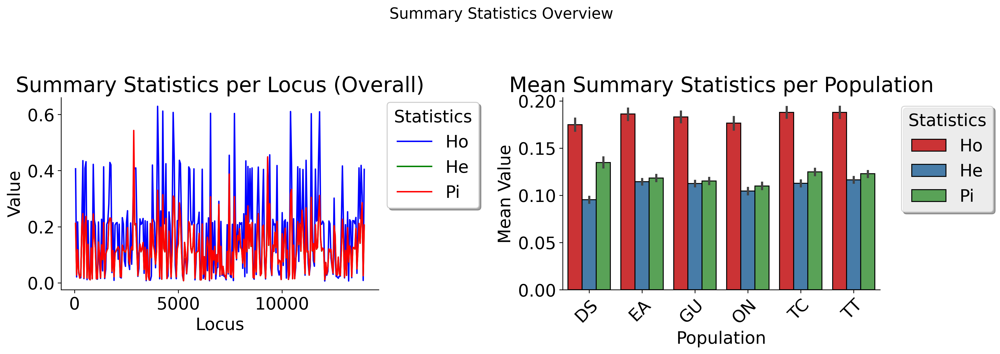
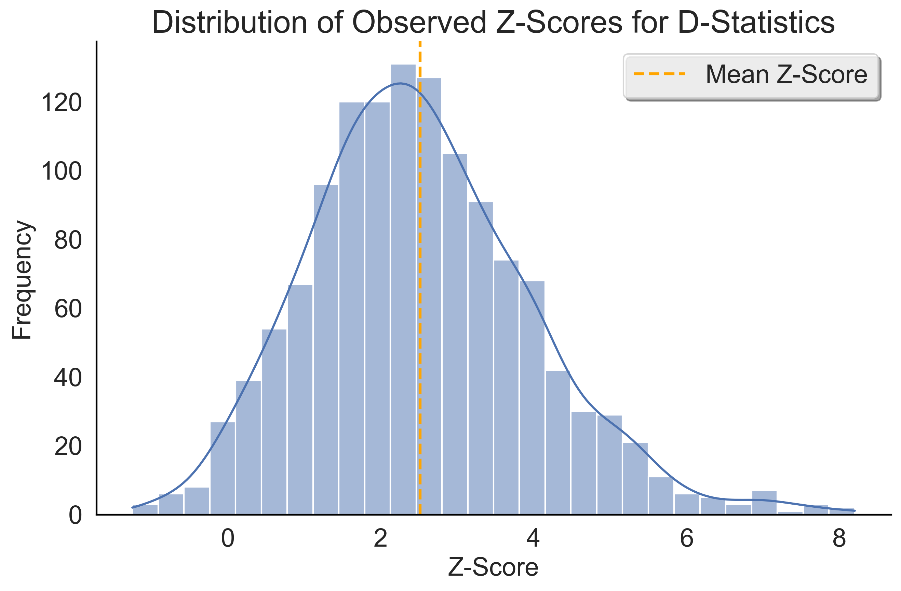
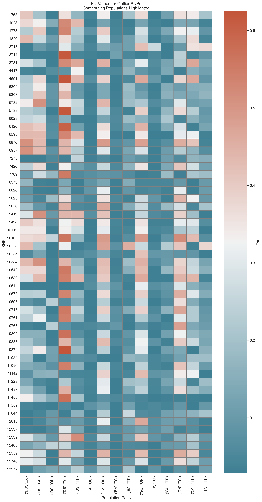

Getting Started
===============

.. image:: ../../../snpio/img/snpio_logo.png
  :align: center
  :alt: SNPio Logo
  :width: 800px
  :height: 400px
  :scale: 100%
  :class: img-responsive

Welcome to SNPio! This guide will help you get started with reading, filtering, encoding, analyzing, and visualizing genotype data for population genomic and phylogenetic analysis.

SNPio supports multiple standard formats — **VCF**, **PHYLIP**, **STRUCTURE**, and **GENEPOP** — and provides a unified `GenotypeData` object for downstream analysis using a consistent interface.

This guide covers:

- Installation options (pip, conda, Docker)
- File readers and formats
- Core usage examples
- Experimental modules like AMOVA and TreeParser

Installation
------------

There are several ways to install SNPio:

- Using `pip` (recommended with a virtual environment)
- Using `conda`
- Using Docker
- (Advanced) Installing globally with `pip` (not recommended)

Installing with pip
^^^^^^^^^^^^^^^^^^^

.. code-block:: shell

  python3 -m venv snpio-env
  source snpio-env/bin/activate
  pip install snpio

.. tip::

  For reproducibility, consider saving your environment to a requirements file:

    ``pip freeze > requirements.txt``

Installing with conda
^^^^^^^^^^^^^^^^^^^^^

.. code-block:: shell

  conda create -n snpio-env python=3.12
  conda activate snpio-env
  conda install -c btmartin721 snpio

Installing with Docker
^^^^^^^^^^^^^^^^^^^^^^

.. code-block:: shell

  docker pull btmartin721/snpio:latest
  docker run -it btmartin721/snpio:latest

.. tip::

  SNPio is designed for Unix-based systems (Linux, macOS). On Windows, use WSL (Windows Subsystem for Linux) for full compatibility.

Importing SNPio
---------------

Once installed, you can import SNPio modules as needed:

.. code-block:: python

  from snpio import (
      VCFReader, PhylipReader, StructureReader, GenePopReader,
      NRemover2, PopGenStatistics, GenotypeEncoder
  )

.. tip::

  Only import the readers or tools you plan to use. This helps avoid clutter, reduces memory usage, and avoids overwhelming your namespace with unused classes.

Reading Genotype Data
---------------------

SNPio provides dedicated readers for each supported format. Each reader returns a `GenotypeData` object, which enables downstream filtering, encoding, and statistical analyses.

Here’s a minimal VCF loading example:

.. code-block:: python

  vcf = "snpio/example_data/vcf_files/phylogen_subset14K_sorted.vcf.gz"
  popmap = "snpio/example_data/popmaps/phylogen_nomx.popmap"

  gd = VCFReader(
      filename=vcf,
      popmapfile=popmap,
      force_popmap=True,
      prefix="snpio_example",
      plot_format="png",
      verbose=True
  )

Specifying Populations
----------------------

You can restrict analysis to specific populations using `include_pops` and/or `exclude_pops`:

.. code-block:: python

  gd = VCFReader(
      filename=vcf,
      popmapfile=popmap,
      prefix="snpio_example",
      include_pops=["EA", "GU", "ON"],
      exclude_pops=["MX", "YU"]
  )

.. tip::

  You can combine `include_pops` and `exclude_pops` to enforce fine-grained control. Just be sure they don’t overlap.

.. note::

  The population IDs in `include_pops` and `exclude_pops` must not overlap. If they do, an error will be raised.

force_popmap Behavior
---------------------

The `force_popmap=True` option attempts to align the popmap and alignment automatically by:

- Removing unmatched samples
- Sorting both to match order
- Avoiding errors on slight mismatches

If set to `False`, exact correspondence is required between the popmap and alignment sample IDs.

Supported Missing Data Characters
---------------------------------

All SNPio readers treat the following as missing genotypes:

- `"N"`
- `"."`
- `"?"`
- `"-"`

Population Map File Format
--------------------------

Popmap files map sample IDs to population IDs. SNPio supports:

- Whitespace- or comma-delimited files
- Optional header row: `SampleID`, `PopulationID`

Example (no header):

.. code-block:: none

  Sample1,Population1
  Sample2,Population1
  Sample3,Population2

Example (with header):

.. code-block:: none

  SampleID,PopulationID
  Sample1,Population1
  Sample2,Population1
  Sample3,Population2

Writing Genotype Data to File
-----------------------------

All `GenotypeData` objects created by SNPio readers (e.g., `VCFReader`, `PhylipReader`, `StructureReader`, `GenePopReader`) support interoperable export methods. This allows you to convert between formats seamlessly, regardless of the original input type.

Available write methods:

- ``write_vcf(filepath)`` - Export to bgzipped VCF format
- ``write_phylip(filepath)`` - Export to sequential PHYLIP format
- ``write_structure(filepath)`` - Export to STRUCTURE format
- ``write_genepop(filepath)`` - Export to GENEPOP format
- ``write_popmap(filepath)`` - Export population map file. Useful if samples were filtered or modified.

These methods are available directly from any `GenotypeData` object.

Examples
^^^^^^^^

Export filtered data to a new VCF:

.. code-block:: python

  gd.write_vcf("output_data.vcf.gz")

Convert a VCF file to STRUCTURE format:

.. code-block:: python

  from snpio import VCFReader

  gd = VCFReader(
      filename="input.vcf.gz",
      popmapfile="popmap.txt",
      force_popmap=True,
      prefix="converted_data"
  )

  gd.write_structure("converted_data.str")

Convert STRUCTURE → PHYLIP:

.. code-block:: python

  from snpio import StructureReader

  gd = StructureReader(
      filename="input_structure.str",
      popmapfile="popmap.txt"
  )

  gd.write_phylip("converted.phy")

Convert GENEPOP → VCF:

.. code-block:: python

  from snpio import GenePopReader

  gd = GenePopReader(
      filename="example.gen",
      popmapfile="popmap.txt"
  )

  gd.write_vcf("converted_from_genepop.vcf")

Notes
^^^^^

- Output files can be compressed (e.g., `.vcf.gz`) or plain text.
- The same `GenotypeData` object can be written to **any supported format**, regardless of input format.
- SNPio handles internal data transformation automatically (e.g., allele formats, headers, sample ordering).

.. tip::

  This interoperability is useful for converting legacy formats or preparing input for downstream tools that require a specific genotype format.

Next Steps
----------

Now that you've successfully loaded data, you're ready to filter, encode, and analyze genotype datasets using `NRemover2`, `GenotypeEncoder`, and `PopGenStatistics`.

Continue to the next section: **Filtering with NRemover2**.

Filtering Genotype Data with NRemover2
======================================

The `NRemover2` class provides a flexible and efficient way to clean and preprocess your genotype dataset before downstream analysis. It supports filters for:

- Missing data thresholds (per sample, locus, population)
- Minor allele count (MAC) and frequency (MAF)
- Singleton and monomorphic loci
- Biallelic filtering
- Locus thinning and linked loci pruning
- Random subsetting

Filters can be chained and must be finalized with `.resolve()`.

Basic Example
-------------

.. code-block:: python

  from snpio import NRemover2

  nrm = NRemover2(genotype_data)

  gd_filt = (
      nrm.filter_missing_sample(0.75)
        .filter_missing(0.75)
        .filter_missing_pop(0.75)
        .filter_mac(2)
        .filter_monomorphic(exclude_heterozygous=True)
        .filter_singletons(exclude_heterozygous=True)
        .filter_biallelic(exclude_heterozygous=True)
        .resolve()
  )

  # Save filtered VCF
  gd_filt.write_vcf("filtered_output.vcf.gz")

.. note::

   You **must** call `.resolve()` at the end of the filter chain to apply the filtering logic and return a new `GenotypeData` object.

Filtering with exclude_heterozygous
-----------------------------------

Many filters accept the `exclude_heterozygous=True` flag, which ensures that only homozygous genotypes are considered during filtering. For example:

- `filter_singletons(exclude_heterozygous=True)` removes singletons where the minor allele is present in only one homozygous genotype. If the minor allele is present in a heterozygous genotype, it will not be counted as a singleton, but rather as a monomorphic site.
- `filter_biallelic(exclude_heterozygous=True)` retains only sites with at least one homozygous reference and one homozygous alternate.
- `filter_monomorphic(exclude_heterozygous=True)` removes sites with only one allele. A site with a heterozygous genotype and all homozygous reference genotypes will still be considered monomorphic if `exclude_heterozygous=True` is set, as it will not count the heterozygous genotype as a valid allele.

.. tip::

  Use `exclude_heterozygous=True` when you want to apply conservative filters that rely only on clear homozygous calls.

Key Filtering Methods
---------------------

.. list-table::
  :header-rows: 1
  :widths: 25 75

  * - Method
    - Description
  * - ``filter_missing_sample(thresh)``
    - Removes individuals with missing data above `threshold`.
  * - ``filter_missing(thresh)``
    - Removes loci with missing data above `threshold`.
  * - ``filter_missing_pop(thresh)``
    - Removes loci where any population exceeds `threshold` missingness.
  * - ``filter_mac(thresh)``
    - Removes loci with MAC below `threshold`.
  * - ``filter_maf(thresh)``
    - Removes loci with MAF below `threshold`.
  * - ``filter_monomorphic(...)``
    - Removes sites with only one allele.
  * - ``filter_singletons(...)``
    - Removes loci where the minor allele is present in only one genotype.
  * - ``filter_biallelic(...)``
    - Retains loci with exactly two alleles.
  * - ``thin_loci(size)``
    - Retains one SNP within every `size` bp window.
  * - ``filter_linked(size)``
    - Keeps only one SNP per scaffold/chromosome within `size` bp.
  * - ``random_subset_loci(size)``
    - Selects a random subset of `size` loci.
  * - ``resolve()``
    - Finalizes and applies all filters.

.. note::

  `thin_loci()` and `filter_linked()` are only available for `VCFReader` input. They rely on chromosome and position metadata.

Threshold Grid Search
---------------------

Use `search_thresholds()` to explore the effects of various filtering thresholds:

.. code-block:: python

  nrm = NRemover2(genotype_data)

  nrm.search_thresholds(
      thresholds=[0.25, 0.5, 0.75, 1.0],
      maf_thresholds=[0.01, 0.05],
      mac_thresholds=[2, 5],
      filter_order=[
          "filter_missing_sample",
          "filter_missing",
          "filter_missing_pop",
          "filter_mac",
          "filter_monomorphic",
          "filter_singletons",
          "filter_biallelic"
      ]
  )

.. tip::

  Grid search helps identify thresholds that retain maximum informative loci while reducing noise from missing or rare variants.

.. note::

   `search_thresholds()` is **incompatible** with `thin_loci()`, `filter_linked()`, and `random_subset_loci()`.

Filtering Visualizations
------------------------

Missingness Reports
^^^^^^^^^^^^^^^^^^^

After filtering, you can inspect missing data levels:

.. code-block:: python

  gd_filt.missingness_reports(prefix="filtered")

.. figure:: ../../../snpio/img/missingness_report.png
  :alt: Missing Data Report
  :figclass: img-responsive

  Figure: Per-sample, Per-locus, and Population-level missing data summaries.

Sankey Diagram
^^^^^^^^^^^^^^

Visualize how many loci are retained vs. removed at each filter step:

.. code-block:: python

  nrm.plot_sankey_filtering_report()

.. figure:: ../../../snpio/img/nremover_sankey_plot.png
  :alt: Sankey plot of filtering steps
  :figclass: img-responsive

  Figure: Sankey diagram showing filter effects at each stage. Bands are proportional to the number of loci retained (green) or removed (red) at each step.

.. note::

   The Sankey diagram only visualizes *loci*, not *samples*. It also must be run **after** `.resolve()`.

.. note::

  `plot_sankey_filtering_report()` does not render `thin_loci()`, `filter_linked()`, `random_subset_loci()`, or `filter_missing_samples()`.

Best Practices
--------------

- Always inspect missingness and allele distributions before analysis.
- Use `search_thresholds()` to identify optimal filter thresholds for your dataset.
- Call `.resolve()` before using filtered data downstream.
- Combine visual tools (Sankey, missingness plots) to guide decisions.

Next Steps
----------

Continue to **Section 3: Encoding Genotype Data for Machine Learning and AI** using the `GenotypeEncoder` class.

Encoding Genotype Data
======================

SNPio provides the `GenotypeEncoder` class for converting genotype data into formats suitable for AI, machine learning, and numerical analyses. It supports:

- **One-hot encoding** (multi-label binary)
- **Integer encoding** (categorical)
- **0-1-2 encoding** (for additive genetic models)

These formats can be used directly in machine learning pipelines or population genomic models.

Importing GenotypeEncoder
-------------------------

.. code-block:: python

  from snpio import VCFReader, GenotypeEncoder

  gd = VCFReader(
      filename="snpio/example_data/vcf_files/phylogen_subset14K_sorted.vcf.gz",
      popmapfile="snpio/example_data/popmaps/phylogen_nomx.popmap",
      force_popmap=True,
      prefix="snpio_example",
      verbose=True
  )

  encoder = GenotypeEncoder(gd)

Encoding Formats
----------------

One-Hot Encoding
^^^^^^^^^^^^^^^^

.. code-block:: python

  gt_ohe = encoder.genotypes_onehot

Each base or IUPAC code is represented as a vector:

.. code-block:: python

  {
      "A": [1.0, 0.0, 0.0, 0.0],
      "T": [0.0, 1.0, 0.0, 0.0],
      "G": [0.0, 0.0, 1.0, 0.0],
      "C": [0.0, 0.0, 0.0, 1.0],
      "N": [0.0, 0.0, 0.0, 0.0],
      "W": [1.0, 1.0, 0.0, 0.0],
      "R": [1.0, 0.0, 1.0, 0.0],
      "M": [1.0, 0.0, 0.0, 1.0],
      "K": [0.0, 1.0, 1.0, 0.0],
      "Y": [0.0, 1.0, 0.0, 1.0],
      "S": [0.0, 0.0, 1.0, 1.0]
  }

Integer Encoding
^^^^^^^^^^^^^^^^

.. code-block:: python

  gt_int = encoder.genotypes_int

Each genotype is mapped to a unique integer:

- `"A"` = 0, `"T"` = 1, `"G"` = 2, `"C"` = 3
- IUPAC heterozygotes (e.g., `"W"`, `"R"`) = 4-9
- Missing values = `-9`

0-1-2 Encoding
^^^^^^^^^^^^^^

.. code-block:: python

  gt_012 = encoder.genotypes_012

Encodes phased diploid data:

- `0` = Homozygous reference
- `1` = Heterozygous
- `2` = Homozygous alternate
- `-9` = Missing

Reversing the Encoding
----------------------

All encodings are **bi-directional**. You can convert encoded data back to genotypes by setting the property:

.. code-block:: python

  encoder.genotypes_onehot = gt_ohe
  encoder.genotypes_int = gt_int
  encoder.genotypes_012 = gt_012

This updates the original `GenotypeData.snp_data` matrix with the decoded genotype values.

Use Cases
---------

- **AI and ML training data**: Convert to numerical format for model input
- **Dimensionality reduction (e.g., PCA, t-SNE)**: Use 0-1-2 or one-hot formats
- **Visualization**: Heatmaps, clustering, D-statistics, etc.

.. tip::

  The encoder handles IUPAC ambiguity codes seamlessly and supports bidirectional conversion between genotypes and encoded formats.

Next Steps
----------

Proceed to **Section 4: Population Genetic Analyses with `PopGenStatistics`** for computing Fst, heterozygosity, nucleotide diversity, D-statistics, PCA, and more.

Population Genetic Analysis
===========================

The `PopGenStatistics` class provides a unified interface to perform key population genetic analyses using your filtered `GenotypeData` object.

It supports:

- Summary statistics: He, Ho, Pi, pairwise Weir & Cockerham Fst :cite:p:`WeirCockerham1984`
- Nei's genetic distance :cite:p:`Nei1972`
- D-statistics: Patterson's :cite:p:`PattersonPriceReich2006,GreenEtAl2010` partitioned :cite:p:`EatonRee2013` and D-FOIL :cite:p:`PeaseHahn2015`
- Fst outlier detection :cite:p:`BeaumontNichols1996,FollGaggiotti2008`
- Principal Component Analysis (PCA)
- (Experimental) AMOVA :cite:p:`ExcoffierSmouseQuattro1992`

Basic Usage
-----------

.. code-block:: python

  from snpio import VCFReader, PopGenStatistics

  gd = VCFReader(
      filename="example.vcf.gz",
      popmapfile="popmap.txt",
      force_popmap=True,
      prefix="analysis_output",
      verbose=True
  )

  pgs = PopGenStatistics(gd)

  summary = pgs.summary_statistics(n_permutations=100, use_pvalues=True)

Calculates:

- Observed heterozygosity (Ho)
- Expected heterozygosity (He)
- Nucleotide diversity (π)
- Pairwise Fst (Weir & Cockerham, 1984)

Includes per-population tables and visualizations.

  Figure: Ho, He, and π per-locus and overall means across populations.

Pairwise Fst Heatmap
--------------------

Automatically generated with `summary_statistics()`:

.. figure:: ../../../snpio/img/fst_between_populations_heatmap.png
  :alt: Pairwise Fst heatmap
  :figclass: img-responsive

  Figure: Pairwise Fst matrix. Lighter colors indicate higher differentiation.

Nei's (1972) Genetic Distance
-----------------------------

.. code-block:: python

  df_nei, df_pvals = pgs.neis_genetic_distance(
      n_bootstraps=1000,
      use_pvalues=True,
      n_jobs=-1
  )

.. figure:: ../../../snpio/img/nei_between_populations_heatmap.png
  :alt: Nei's Genetic Distance Heatmap
  :figclass: img-responsive

  Figure: Heatmap showing Nei's (1972) genetic distance between populations.

D-Statistics
------------

Supports 3 D-statistic types:

- Patterson's D
- Partitioned D
- D-FOIL D

.. code-block:: python

  dstats_df, summary = pgs.calculate_d_statistics(
      method="patterson",
      population1="EA",
      population2="GU",
      population3="TT",
      outgroup="ON",
      num_bootstraps=1000,
      max_individuals_per_pop=5
  )

  Figure: Histogram of D-statistics values across bootstrap replicates.

.. figure:: ../../../snpio/img/d_statistics_significance_counts.png
  :alt: Significance bar plot
  :figclass: img-responsive

  Figure: Bar plot showing counts of significant D-statistics across bootstrap replicates.

.. tip::

  Use `max_individuals_per_pop` to control the number of individuals sampled per population when calculating D-statistics. This ensures performance scaling and avoids bias due to uneven sample sizes.

Fst Outlier Detection
---------------------

Supports two methods:

- Traditional permutations
- DBSCAN clustering

.. code-block:: python

  df_outliers, df_pvals = pgs.detect_fst_outliers(
      n_permutations=1000,
      correction_method="fdr_bh",
      n_jobs=4
  )

  df_dbscan, _ = pgs.detect_fst_outliers(
      use_dbscan=True,
      correction_method="fdr_bh",
      n_jobs=4
  )

  Figure: Outlier SNPs based on Fst between population pairs.

.. tip::

  DBSCAN is sensitive to parameter tuning. If the default values return too few or too many outliers, experiment with `eps` and `min_samples`.

Principal Component Analysis (PCA)
----------------------------------

.. code-block:: python

  pgs.pca()

Generates PCA plots colored by population, with markers indicating missing data proportions.

AMOVA (Experimental)
--------------------

.. code-block:: python

  amova_result = pgs.amova(
      regionmap={
          "EA": "East",
          "GU": "East",
          "TT": "East",
          "DS": "West"
      },
      n_bootstraps=100,
      n_jobs=1
  )

Performs Analysis of Molecular Variance based on hierarchical population structure.

PopGenStatistics Method Summary
-------------------------------

.. list-table::
  :header-rows: 1
  :widths: 25 35 40

  * - Method
    - Description
    - Algorithm(s)
  * - ``summary_statistics()``
    - Calculates He, Ho, π, and Fst.
    - Standard formulas + bootstrapping
  * - ``neis_genetic_distance()``
    - Computes Nei’s pairwise distances.
    - Nei (1972)
  * - ``calculate_d_statistics()``
    - Calculates Patterson/Partitioned/D-FOIL.
    - ABBA-BABA framework
  * - ``detect_fst_outliers()``
    - Detects outlier loci.
    - Permutations or DBSCAN
  * - ``pca()``
    - Runs PCA and creates visualizations.
    - scikit-learn PCA
  * - ``amova()`` *(experimental)*
    - Performs AMOVA.
    - Hierarchical variance partitioning

Next Steps
----------

Continue to **Section 5: MultiQC Report Generation** if you want to explore SNPio's support for generating interactive MultiQC reports.

MultiQC Report Generation
=========================

SNPio includes built-in support for generating **interactive MultiQC reports** that summarize results from all major analysis modules. These reports are ideal for data exploration, publication-ready figures, and batch comparisons.

The `SNPioMultiQCReport` class automatically collects results from:

- Filtering (`NRemover2`)
- Summary statistics and Fst estimates (`PopGenStatistics`)
- Genetic distance matrices (Nei's, Weir & Cockerham's)
- D-statistics (Patterson, Partitioned, D-FOIL)
- Fst Outlier detection (DBSCAN, permutations)
- Genotype encodings (`GenotypeEncoder`)
- PCA
- Input/output summary tables (e.g., number of samples/loci retained)

Basic Example
-------------

After completing your filtering and statistical analyses:

.. code-block:: python

  from snpio import SNPioMultiQC

  report = SNPioMultiQC.build(
      prefix="my_report",
      output_dir="results/multiqc",
      overwrite=True,
  )

.. note::

  ``SNPioMultiQC`` should not be initialized directly. Instead, use it **without parentheses** followed by calling the `build()` method to generate the report from the current session's results.

.. tip::

    ``SNPioMultiQC`` should be called **after** all filtering and analysis steps are complete. It collects results from the current session and generates a comprehensive report of all filtering and analysis results.

This creates a self-contained `.html` report with interactive visualizations, significance summaries, and analysis metadata.

.. tip::

  The MultiQC HTML report can be viewed in Firefox, Chrome, and possibly other web browsers. It is fully self-contained, meaning all data and visualizations are embedded in the HTML file.

.. note::

  MultiQC support is available for all formats supported by SNPio (VCF, PHYLIP, STRUCTURE, GENEPOP).

Report Contents
---------------

The SNPio MultiQC report includes:

- **Filtering Summary** (Sankey plot, missingness, sample/locus counts)
- **Summary Statistics** (He, Ho, π)
- **Pairwise Fst Matrix** (Weir & Cockerham)
- **Nei's Distance Heatmap**
- **D-statistics** (histograms, significance bar plots)
- **Fst Outlier Heatmaps**
- **PCA** (colored by population)
- **Input Metadata Table** (samples, loci, populations)

Custom Report Location
----------------------

You can control the report path:

.. code-block:: python

  SNPioMultiQC.build(
        prefix="Example Report",
        output_dir="results/multiqc",
        overwrite=True,
    )

.. tip::

  All generated reports are self-contained HTML files and require no internet connection to view.

Exporting Report Data
---------------------

All visualizations in the report are backed by exportable CSV and JSON data, saved alongside the HTML file. This allows integration into downstream tools or publications.

.. tip::

  The MultiQC HTML report is fully portable—just open the file in any browser or send it to collaborators.

Integration with Analysis Pipeline
----------------------------------

You can integrate report generation as a final step in your SNPio pipeline:

.. code-block:: python

  # After all file I/O, filtering, encoding, and running PopGenStatistics
  SNPioMultiQC.build(
        prefix="Example Report",
        output_dir="results/multiqc",
        overwrite=True,
    )

Next Steps
----------

Continue to **Section 6: Experimental Tree Parsing and Phylogenetic Analysis** if you want to explore SNPio's capabilities for working with phylogenetic trees and evolutionary models.

Tree Parsing and Phylogenetic Analysis (Experimental)
======================================================

SNPio includes an experimental module, `TreeParser`, for working with phylogenetic trees in **Newick** or **NEXUS** formats. This class enables:

- Reading and writing trees
- Drawing and visualizing trees
- Rerooting and pruning trees
- Extracting subtrees by sample name
- Getting distance matrices and rate models (Q-matrix, site rates)

Basic Example
-------------

.. code-block:: python

  from snpio import VCFReader, TreeParser

  gd = VCFReader(
      filename="snpio/example_data/vcf_files/phylogen_subset14K_sorted.vcf.gz",
      popmapfile="snpio/example_data/popmaps/phylogen_nomx.popmap",
      force_popmap=True,
      prefix="snpio_example"
  )

  tp = TreeParser(
      genotype_data=gd,
      treefile="snpio/example_data/trees/test.tre",
      siterates="snpio/example_data/trees/test14K.rates",
      qmatrix="snpio/example_data/trees/test.iqtree",
      verbose=True
  )

Reading and Drawing Trees
-------------------------

.. code-block:: python

  tree = tp.read_tree()
  tree.draw()  # Visualize the tree

Saving Trees to File
--------------------

Save in Newick format:

.. code-block:: python

  tp.write_tree(tree, save_path="output_tree.tre")

Save in NEXUS format:

.. code-block:: python

  tp.write_tree(tree, save_path="output_tree.nex", nexus=True)

Return tree as a string:

.. code-block:: python

  newick_string = tp.write_tree(tree, save_path=None)

Tree Editing and Analysis
-------------------------

Reroot tree using samples matching a pattern:

.. code-block:: python

  tp.reroot_tree("~EA")  # Uses regex to match sample names containing 'EA'

Prune samples:

.. code-block:: python

  pruned = tp.prune_tree("~ON")

Extract subtree from a sample pattern:

.. code-block:: python

  subtree = tp.get_subtree("~EA")

Write pruned tree to file:

.. code-block:: python

  tp.write_tree(pruned, save_path="pruned_tree.tre")

Inspect tree statistics:

.. code-block:: python

  stats = tp.tree_stats()
  print(stats)

Distance Matrix and Evolutionary Rates
--------------------------------------

Get full distance matrix between all nodes:

.. code-block:: python

  dist_matrix = tp.get_distance_matrix()

Access the rate matrix Q (from `.iqtree` file or Q-matrix):

.. code-block:: python

  print(tp.qmat)

Access site-specific substitution rates:

.. code-block:: python

  print(tp.site_rates)

Input File Notes
----------------

- **treefile**: Required. Accepts Newick or NEXUS.
- **siterates**: Optional. One-column file with rate per alignment site.
- **qmatrix**: Optional. Can be parsed from `.iqtree` or provided as a CSV or TSV file with a 4×4 substitution rate matrix for A/C/G/T.

Experimental Status
-------------------

.. warning::

  `TreeParser` is still under active development. Interface and behavior may change in future versions.

.. tip::

  Regular expressions can be used with `~` prefix in `get_subtree()` and `prune_tree()`.

Example Use Case: Extracting a Subtree and Saving to Newick
------------------------------------------------------------

.. code-block:: python

  subtree = tp.get_subtree("~EA")
  newick = tp.write_tree(subtree, save_path=None)
  print(newick)

Conclusion
----------

`TreeParser` allows for interactive tree visualization and manipulation, fully integrated with SNPio's genotype data. This feature is especially useful for combining genetic variation data with phylogenetic inference pipelines.

Thank you for using SNPio! We hope this guide helps you get started with reading, filtering, encoding, analyzing, and visualizing your genotype data effectively. For more advanced usage and examples, please refer to the documentation or explore the source code on GitHub.

For any questions or issues, feel free to open an issue on the SNPio `GitHub <https://github.com/btmartin721/SNPio>`_ repository.

References
==========

.. bibliography:: refs.bib
