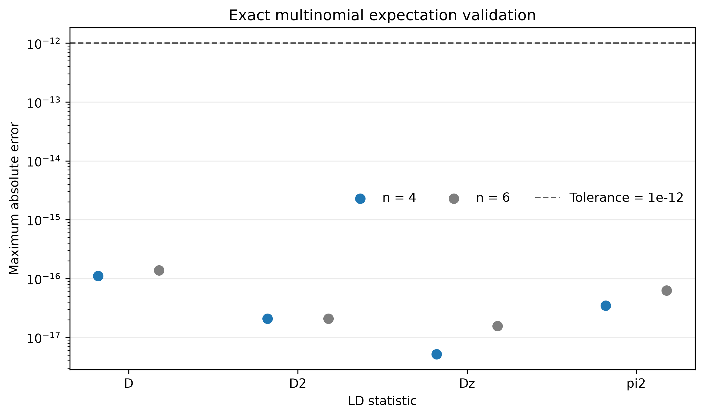
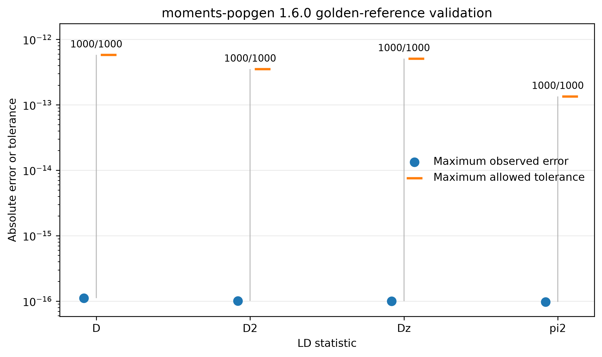
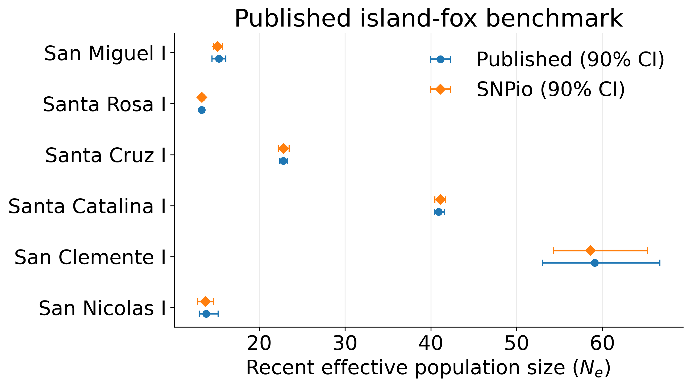
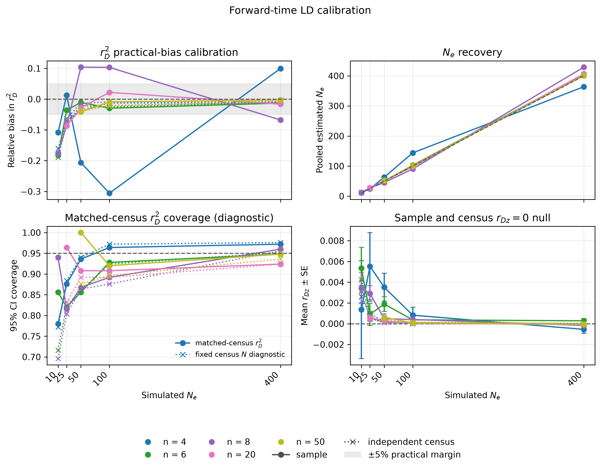
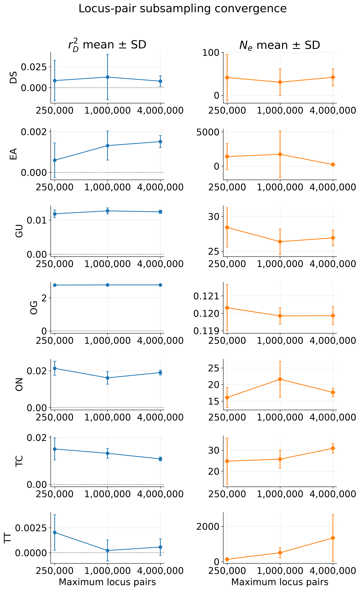

Validating Linkage Disequilibrium Estimates
===========================================

SNPio includes an independent validation suite for the unbiased unphased LD
implementation. Validation is deliberately separated from the production
analysis API in ``snpio.validation`` and ``scripts/validate_ld.py``. Neither
``moments-popgen`` nor a simulator is imported during an ordinary SNPio run.

Validation code and evidence locations
--------------------------------------

Executable validation infrastructure for new SNPio features belongs under the
repository's `snpio/validation/ directory
<https://github.com/btmartin721/SNPio/tree/master/snpio/validation>`_. For the
unphased LD and recent :math:`N_e` implementation, the principal files are:

- `snpio/validation/linkage_disequilibrium.py
  <https://github.com/btmartin721/SNPio/blob/master/snpio/validation/linkage_disequilibrium.py>`_
  for exact expectations, golden-reference comparisons, published benchmarks,
  and convergence orchestration;
- `snpio/validation/ld_simulation.py
  <https://github.com/btmartin721/SNPio/blob/master/snpio/validation/ld_simulation.py>`_
  for neutral forward-time calibration;
- `snpio/validation/ld_plots.py
  <https://github.com/btmartin721/SNPio/blob/master/snpio/validation/ld_plots.py>`_
  for validation figures; and
- ``snpio/validation/data/`` for the frozen independent-reference fixtures.

Raw runs are written beneath the ignored ``validation_results/`` directory.
Reviewed, portable, checksummed evidence is promoted separately to the root
`validation/ directory
<https://github.com/btmartin721/SNPio/tree/master/validation>`_. The
authoritative feature registry and interpretation are in
``validation/MANIFEST.md``. This separation is the standard for future SNPio
features: executable checks live in ``snpio/validation/`` and compact user-
facing evidence lives in ``validation/``.

Validation hierarchy
--------------------

No single comparison is sufficient. The recommended evidence has four layers:

1. **Exact finite-sample expectations.** For small samples, enumerate every
   possible count vector for the nine two-locus diploid genotype states. Weight
   each SNPio estimate by its multinomial probability and compare the exact
   expectation with the population formula. This directly tests unbiasedness.
2. **Independent golden outputs.** Compare 1,000 diverse count vectors with a
   frozen corpus generated once by ``moments-popgen 1.6.0``, the paper authors'
   implementation. The dependency is not needed to run the comparison.
3. **Forward-time calibration.** Simulate known Wright--Fisher population
   sizes, independent chromosome assortment, and neutral mutations. Evaluate
   bias in :math:`r_D^2`, the :math:`r_{Dz}=0` null, inferred
   :math:`N_e`, and matched-census bootstrap coverage across replicates.
4. **Empirical benchmarks and convergence.** Reproduce the island-fox results
   in :cite:t:`RagsdaleGravel2020`, then measure sensitivity to the locus-pair
   budget and random seed in the target dataset.

The ordinary unit suite also checks allele-label and locus-order invariance,
literal nine-state genotype counting, unique canonical locus pairs,
within-group exclusion, ratio-of-sums aggregation, deterministic parallel
results, population-specific monomorphism, and seeded block bootstrapping.

Curated validation results
--------------------------

The promoted snapshot ``20260717T003026Z_ea14ecf`` records passing evidence
for all six required layers: 38 focused tests, 32 exact-enumeration checks,
4,000 frozen-reference comparisons, six published island-fox comparisons, 22
forward-calibration cells with 250 replicates each, and 105 pair-budget
convergence analyses. The snapshot contains a six-row machine-readable status
table and SHA-256 checksums for every promoted artifact.

The source working trees were recorded as dirty and shared the same base
commit. Steps 1--5 came from the final forward-calibration run, while the
already-completed step 6 came from a compatible earlier invocation. This
provenance boundary is retained in the source-run metadata and manifest; a
single clean-tree rerun is the preferred future release-grade replacement.

Exact finite-sample expectations
^^^^^^^^^^^^^^^^^^^^^^^^^^^^^^^^

   Maximum absolute errors from exhaustive multinomial enumeration. All 32
   checks are below the :math:`10^{-12}` acceptance tolerance.

Frozen independent reference
^^^^^^^^^^^^^^^^^^^^^^^^^^^^^

   Maximum observed numerical error versus the frozen ``moments-popgen 1.6.0``
   reference and the permitted tolerance. All 1,000 cases pass for each of
   ``D``, ``D2``, ``Dz``, and ``Pi2``.

Published island-fox benchmark
^^^^^^^^^^^^^^^^^^^^^^^^^^^^^^

   SNPio estimates and 90% intervals compared with the six published
   island-fox estimates in :cite:t:`RagsdaleGravel2020`, using the empirical
   data originating from :cite:t:`FunkEtAl2016`. All intervals overlap and the
   maximum relative point-estimate difference is 1.09%.

Neutral forward-time calibration
^^^^^^^^^^^^^^^^^^^^^^^^^^^^^^^^

   Calibration across simulated :math:`N_e` and sample sizes. The panels show
   practical bias in :math:`r_D^2`, pooled :math:`N_e` recovery, diagnostic
   matched-census interval coverage, and the :math:`r_{Dz}=0` null. The
   horizontal population-size axis is linear.

Target-data pair-budget convergence
^^^^^^^^^^^^^^^^^^^^^^^^^^^^^^^^^^^

   Population-specific mean and standard deviation across five seeds at
   250,000, 1,000,000, and 4,000,000 maximum locus pairs. The figure is a
   sensitivity diagnostic: small samples or estimates near zero can remain
   variable even after increasing the pair budget.

Fast deterministic validation
-----------------------------

Run the exact and golden-reference layers from the repository root:

.. code-block:: shell

  python scripts/validate_ld.py exact
  python scripts/validate_ld.py golden
  python -m pytest tests/test_linkage_disequilibrium.py tests/test_ld_validation.py

The default exact grid covers four haplotype-frequency scenarios at sample
sizes four and six. The committed reference contains 1,000 count vectors and
4,000 statistic-level comparisons. Both commands return a nonzero status when
any tolerance check fails and write CSV plus JSON status files. Every
validation command also writes a 300-DPI PNG and a vector PDF beneath its own
``plots`` directory. The complete output layout is::

  validation_results/linkage_disequilibrium/
  ├── exact/plots/exact_expectation_errors.{png,pdf}
  ├── golden_reference/plots/golden_reference_errors.{png,pdf}
  ├── simulation/plots/simulation_calibration.{png,pdf}
  ├── published_island_fox/plots/
  │   └── published_island_fox_comparison.{png,pdf}
  └── convergence/plots/pair_convergence.{png,pdf}

Use the global ``--plot-formats`` and ``--plot-dpi`` options before the
subcommand to change these defaults. For example:

.. code-block:: shell

  python scripts/validate_ld.py \
      --plot-formats png pdf svg \
      --plot-dpi 400 \
      golden

The golden corpus is stored in
``snpio/validation/data/moments_popgen_1_6_0_golden.csv.gz`` with a SHA-256
provenance sidecar. It can be regenerated for audit purposes with the
maintenance script below, but regeneration is not part of testing:

.. code-block:: shell

  python -m pip install --target /tmp/snpio-moments-reference \
      --no-deps moments-popgen==1.6.0
  python scripts/validation/generate_ld_golden_fixture.py \
      --moments-source /tmp/snpio-moments-reference

Robust all-layer runner
-----------------------

The repository includes a portable zsh driver that runs the focused unit
tests, exact expectations, golden-reference comparison, published island-fox
benchmark, the full forward-simulation grid, and target-dataset convergence.
It writes each invocation to a separate timestamped directory with per-step
logs, a TSV step summary, environment metadata, CSV/JSON results, and PNG/PDF
plots:

.. code-block:: shell

  python -m pip install -e '.[dev,ld-validation]'

  scripts/run_robust_ld_validation.zsh \
      --genepop /path/to/GP_NO_grays.txt \
      --jobs 8

Inspect the complete command set without executing it with ``--dry-run``.
The default simulation uses 250 replicates per valid population-size/sample-
size cell, including the minimum supported ``n=4`` boundary, while convergence
uses 250,000, 1,000,000, and 4,000,000 pair
budgets across five seeds. Use ``--output`` to select a new result directory.
The script refuses to reuse a nonempty directory to protect earlier runs.
Published, simulation, test, or convergence layers can be explicitly skipped
when their inputs or optional dependencies are unavailable.
The default forward acceptance contract uses a 5% practical model-bias margin
and reports chromosome-only population coverage as a diagnostic.

Forward-time calibration
------------------------

Install the optional validation dependencies separately from the runtime
requirements:

.. code-block:: shell

  python -m pip install -e '.[ld-validation]'

The calibration uses ``fwdpy11`` for forward-time diploid Wright--Fisher
ancestry, ``BinomialPoint(..., 0.5)`` boundaries for independent chromosome
assortment, ``tskit`` for tree-sequence interchange, and ``msprime`` for a
neutral binary mutation overlay. ``tskit`` is infrastructure here; its LD
calculator is not treated as an oracle because it estimates a different,
phased statistic. The standard calibration allows the same diploid to be
drawn twice as a parent, matching Wright--Fisher parent sampling with
replacement and the target :math:`r_D^2=1/(3N)`. Pass
``--prohibit-residual-selfing`` only for a distinct-parent model-sensitivity
analysis; that model has a larger realized effective size, particularly at
small census sizes.

Start with the smoke grid, then run the preregistered full grid:

.. code-block:: shell

  python scripts/validate_ld.py simulate --quick --n-jobs 2

  python scripts/validate_ld.py simulate \
      --population-sizes 10 25 50 100 400 \
      --sample-sizes 4 6 8 20 50 \
      --replicates 250 \
      --chromosomes 8 \
      --loci-per-chromosome 100 \
      --burnin-multiplier 10 \
      --allow-residual-selfing \
      --n-bootstraps 200 \
      --minimum-model-population-size 100 \
      --minimum-coverage-sample-size 8 \
      --model-relative-bias-tolerance 0.05 \
      --n-jobs 8 \
      --seed 20260715

Grid cells with a sample size larger than the simulated population are skipped.
For a focused small-population diagnostic, include the lower sampling fraction
``n=4`` and an ``N=100`` reference cell:

.. code-block:: shell

  python scripts/validate_ld.py \
      --output validation_results/linkage_disequilibrium/forward_diagnostic \
      simulate \
      --population-sizes 10 25 100 \
      --sample-sizes 4 6 8 20 \
      --replicates 250 \
      --chromosomes 8 \
      --loci-per-chromosome 100 \
      --burnin-multiplier 10 \
      --allow-residual-selfing \
      --n-bootstraps 200 \
      --minimum-model-population-size 100 \
      --minimum-coverage-sample-size 8 \
      --model-relative-bias-tolerance 0.05 \
      --n-jobs 8 \
      --seed 20260715

The output includes every replicate, the exact configuration, and a summary
containing:

- target :math:`r_D^2=1/(3N_e)`, pooled ratio-of-sums estimate, replicate-
  clustered standard error, relative bias, and standardized bias score;
- the pooled estimate and standardized null score for :math:`r_{Dz}`;
- arithmetic means of replicate ratios as diagnostics only;
- pooled inferred :math:`N_e`;
- matched full-census results at the sample-ascertained loci, used only for
  the paired finite-sample estimator check;
- separately census-ascertained full-census results, used for the forward-
  model :math:`r_D^2` target and :math:`r_{Dz}=0` null checks; and
- empirical coverage of the sample interval for the matched-census
  :math:`r_D^2`, plus fixed-census-:math:`N` coverage as a diagnostic.

The paper defines :math:`r_D^2=E[D^2]/E[\pi_2]`. Therefore the validator pools
the component moments across replicate populations before forming the ratio;
it does not validate the arithmetic mean of replicate-level ratios.
Chromosomes are also retained as the biological bootstrap groups. Each
bootstrap draws chromosomes with replacement and weights a chromosome-pair
summary by the product of its two chromosome multiplicities. This node-
cluster bootstrap preserves dependence among pair summaries that share a
chromosome. The :math:`N_e` interval is obtained by monotonically inverting the
full :math:`r_D^2` interval; when that interval includes zero, the upper
:math:`N_e` endpoint is correctly unbounded rather than being estimated after
discarding nonpositive bootstrap replicates.

Use at least 100 replicates before interpreting standardized bias or coverage.
The :math:`1/(3N)` and independently ascertained census model checks are formal
for :math:`N\geq100`, matching the population-size range used for the paper's
forward benchmark. Smaller populations remain explicit finite-population
stress diagnostics. A formal :math:`r_D^2` model check fails only when the 95%
confidence interval for relative bias lies entirely outside the preregistered
``--model-relative-bias-tolerance`` (5% by default). This is a minimum-effect
test: it detects demonstrated material deviations without misclassifying a
tiny, precisely estimated simulation-model offset as an estimator failure. It
is not an equivalence proof; exact enumeration and the frozen independent
golden reference provide the direct estimator checks. Exact-target
:math:`r_D^2` Z scores are retained as diagnostics, while :math:`r_{Dz}=0`
and the paired sample-versus-matched-census comparison must remain within
three replicate-clustered standard errors. ``Passed_Acceptance_Checks``
records this contract; ``Passed_Z_Checks`` is retained as a compatibility
alias.

The sample interval resamples chromosome groups and therefore represents
genome/locus-pair uncertainty conditional on the sampled individuals. Its
coverage of a matched full-population census additionally asks it to reproduce
individual-sampling uncertainty that it does not resample. Consequently,
matched-census :math:`r_D^2` coverage and fixed-census-:math:`N` coverage remain
reported and plotted, but are diagnostic by default and do not determine
``Passed_Calibration``. Samples of four and six diploids and full-census cells
retain their more specific applicability labels. Use
``--require-population-coverage`` only when deliberately treating the current
chromosome-only interval as a population-target interval; applicable
:math:`n\geq8`, :math:`n<N` cells then become formal coverage gates.

This distinction is evidence based. Holding 800 loci constant, increasing the
number of chromosome groups from 8 to 20 left matched-census coverage at
84--88%, and doubling burn-in from :math:`10N` to :math:`20N` did not improve
it consistently. In contrast, every tested cell passed the paired point-
estimator comparison. The sensitivity result implicates the interval target/
resampling mismatch rather than the Gravel unbiased LD polynomials or an
insufficient forward burn-in.

Published island-fox benchmark
------------------------------

Download ``GP_NO_grays.txt`` from the Dryad dataset associated with
:cite:t:`FunkEtAl2016` and reanalyzed by :cite:t:`RagsdaleGravel2020`
(DOI ``10.5061/dryad.2kn1v``), then run:

.. code-block:: shell

  python scripts/validate_ld.py published \
      --genepop /path/to/GP_NO_grays.txt \
      --n-jobs 8 \
      --seed 20260715

The command maps the six GenePop sections to the table 1 island names, uses all
eligible locus pairs, runs 200 grouped-locus bootstraps, constructs 90%
intervals, and compares the result with the published values. A population
passes when its point estimate is within 5% and its interval overlaps the
published interval. Bootstrap endpoints need not be identical because the
paper does not prescribe SNPio's random seed.

Target-dataset pair convergence
-------------------------------

For the SNPio example dataset discussed in this project, run:

.. code-block:: shell

  python scripts/validate_ld.py convergence \
      --vcf snpio/example_data/vcf_files/phylogen_subset14K.vcf.gz \
      --popmap snpio/example_data/popmaps/phylogen_nomx.popmap \
      --pair-budgets 250000 1000000 4000000 \
      --seeds 101 203 307 409 503 \
      --n-jobs 8

The command writes every run, per-population mean/standard deviation/range/CV,
and the :math:`r_D^2` and :math:`N_e` estimate-versus-pair-budget plot beneath
``validation_results/linkage_disequilibrium/convergence/plots``. By default it
uses VCF chromosome/scaffold labels and excludes within-group pairs. Add
``--assume-unlinked`` only when those labels are known not to represent linked
groups.

Step 6 displays a budget-weighted progress bar across all pair-budget and seed
combinations. The bar reports the current run, budget, seed, elapsed time, rate,
and estimated time remaining, and a 15-second heartbeat keeps the current-run
elapsed time moving during a long calculation. Weighting by the pair budget
prevents the shorter 250,000-pair runs from making the later 4,000,000-pair runs
appear deceptively close to completion. Use ``--no-progress`` to suppress the
bar in automated logs.

Interpret convergence per population. Small samples, low diversity, or a
near-zero denominator can remain variable even when the pair budget is large.
Do not validate a structured, pooled ``Overall`` estimate against the
single-population theory. Also document SNP ascertainment: a phylogenetically
selected or MAF-filtered panel need not satisfy the same expectation as an
unascertained random SNP panel.

What constitutes strong validation?
-----------------------------------

An LD release candidate should satisfy all deterministic tests, reproduce the
published benchmark within the documented criterion, show stable target-data
estimates as the pair budget grows, and present simulation bias/coverage across
the full population-size and sample-size grid. Agreement with a single software
package or a single empirical dataset is supporting evidence, not a complete
validation by itself.
